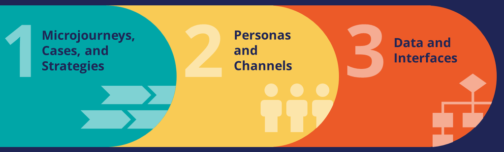

# Defining a customer Microjourney

- [Defining a customer Microjourney](#defining-a-customer-microjourney)
    - [1. PEGA Express delivery approach](#1-pega-express-delivery-approach)
        - [1.1. PEGA Express](#11-pega-express)
        - [1.2. Microjourneys](#12-microjourneys)
        - [1.3. Personas and Channels](#13-personas-and-channels)
        - [1.4. Data and Interfaces](#14-data-and-interfaces)
        - [1.5. Microjourney configuration](#15-microjourney-configuration)
    - [2. Case life cycle](#2-case-life-cycle)
        - [2.1. A business view of work](#21-a-business-view-of-work)
        - [2.2. Case type and cases](#22-case-type-and-cases)
        - [2.3. Case life cycle](#23-case-life-cycle)
        - [2.4. Naming conventions](#24-naming-conventions)
    - [3. Case life cycle design](#3-case-life-cycle-design)
        - [3.1. Business process modelling](#31-business-process-modelling)
        - [3.2. Stage transitions](#32-stage-transitions)
        - [3.3. Stage transitions with automations](#33-stage-transitions-with-automations)
    - [4. Multi-step forms](#4-multi-step-forms)
        - [4.1. Multi-step form navigation](#41-multi-step-form-navigation)
    - [5. Draft mode](#5-draft-mode)
        - [5.1. Turn off draft mode](#51-turn-off-draft-mode)
        - [5.2. Review case type errors](#52-review-case-type-errors)

## 1. PEGA Express delivery approach

### 1.1. PEGA Express

- An agile approach that uses design thinking practices to capture the customer journey and quickly deliver a Minimum Loveable Product (MLP) release.
- You break the customer journey into smaller pieces, called Microjourneys™, which drive the organization to achieve a specific goal.

To define an MLP release, you focus on three core elements, or pillars, of a great application:

### 1.2. Microjourneys

A small part of the overall customer journey and focuses on accomplishing a specific goal.

### 1.3. Personas and Channels

- **Personas** determine who interacts with the application.
- **Channels** determine how a persona interacts with the application.

### 1.4. Data and Interfaces

- **Data** is the information that the Microjourney interacts with to accomplish the customer's goal.
- **interface** defines where the data comes from or where it is persisted. 

### 1.5. Microjourney configuration

- **Case life cycle** 
    * represents a business model of the Microjourney.

- **Personas and Channels**
    * To clearly visualize the participants of your Microjourney, associate personas with case types in your application.

- **Data and Interfaces**
    * Provide the transparency of data that a Microjourney requires by associating data objects with case types.

---

## 2. Case life cycle

### 2.1. A business view of work

- Business applications help automate work that is necessary to achieve specific outcomes.
- Pega thinks applications should function the same way that users think about and describe their work.

### 2.2. Case type and cases

- A **case type** is an abstract model of a business transaction.
- A **case** is a specific transaction instance.

### 2.3. Case life cycle

- represents the business model of the Microjourney.
- models the path your case follows to resolution.

Building blocks of a case type:

* **Stage** - Stages represent the case transfer from one caseworker to another or a significant change in the case status.
* **Process** - contain a series of tasks, or steps, that users complete as they work on the case.
* **Step** - either a user action or automated action within a process performed by the application.

> Each stage can contain one or more processes.

### 2.4. Naming conventions

- Name stages by using a noun, noun phrase, or gerund (which acts as a noun) to describe the section context. As much as possible, try to use no more than two words. Use names that are meaningful and relevant to business users.
- Name processes and steps by using the verb + noun naming convention.

## 3. Case life cycle design

### 3.1. Business process modelling

- enables business users to see and interact with a case the same way that they think about it.

- **Create stage**
    * The first stage in the case life cycle.
    * denoted by a green bar.
    * cannot be deleted or repositioned in the case life cycle.
    * cases are assigned a case ID upon case creation.

- **Create process**
    * the Create stage contains a Create process, which you can modify to meet your business needs.
    * The steps in the Create process should capture initial data.

- **Primary stage**
    * stages that lead to an expected outcome.

> The path that a case takes through the case life cycle without deviating from the primary stages is called the **primary path**.

- **Parallel process**
    * You can configure two or more processes that users can perform in any order as parallel processes. During case processing, the active assignment in either process can be performed, increasing case processing efficiency.

- **Resolution stage**
    * denoted by a red bar.
    * defines case behavior at the end of the case life cycle.
    * indicates that the case finishes its life cycle at the conclusion of the stage.
    * every case type should have at least one resolution stage.

- **Alternate stage**
    * stages that handle deviations from the primary path
    * represent a negative resolution stage
    * used for exception handling
    * allow the case to reenter the primary path when the exception is handled

- **Collect information step**
    * requires user action
    * have green icons

> Create processes that are not channel-specific can only include Collect information steps.

- **Automation step**
    * performed by the system
    * have yellow icons

### 3.2. Stage transitions

Three type of stage transitions

- **Automatically move to next stage** - When all steps in a primary stage are complete, the case automatically transitions to the next primary stage by default.
- **Wait for a user action** - when all stage processes are complete, the case worker receives the option to complete the stage.
- **Resolve the case** - when all stage processes are complete, the case automatically resolves.

> If you select the Resolve the case option, the stage is denoted with a red bar and becomes a resolution stage.

### 3.3. Stage transitions with automations

Use Change stage automation steps to transition the case progression to a specific stage automatically. This type of configuration is most useful for automated transitions to and from alternate stages.

## 4. Multi-step forms

Represents a single assignment completed by a single user. It is a guided, linear workflow using related UI screens.

> Note: The default Create process in the Create stage is a multi-step form. At runtime, this multi-step form displays as a modal by default.

### 4.1. Multi-step form navigation

Multi-step forms provide three templates with different navigation styles:

- horizontal
- vertical
- standard

With horizontal and vertical navigation, users navigate screens using the navigation menu (oriented horizontally or vertically). With standard navigation, users navigate through the screens using Continue and Back buttons.

## 5. Draft mode

- When you create a case type in App Studio, by default all processes you configure are created in draft mode.
- Draft mode allows you to quickly run the case type to check the run-time behavior even with incomplete configurations.

### 5.1. Turn off draft mode

Before an application can be released to production, draft mode must be turned off on all process flows. 

### 5.2. Review case type errors

- App Studio displays a list of errors in your case type that you must resolve before draft mode is automatically turned off.
- You can only manually turn off draft mode from Dev Studio.
