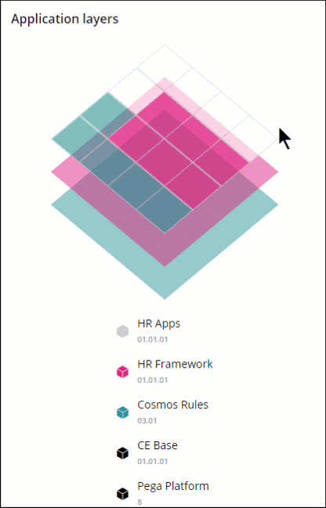

# Low-code defined

- [Low-code defined](#low-code-defined)
    - [1. Low-code application development](#1-low-code-application-development)
        - [1.1. Value of low-code](#11-value-of-low-code)
        - [1.2. Building with low code tools](#12-building-with-low-code-tools)
        - [1.3. Low code and developers](#13-low-code-and-developers)
    - [2. Integrating with external applications](#2-integrating-with-external-applications)
    - [3. Workspaces](#3-workspaces)
    - [4. App Studio](#4-app-studio)
        - [4.1. App Studio Workspace](#41-app-studio-workspace)
        - [4.2. Support for agile development](#42-support-for-agile-development)
        - [4.3. Application profile](#43-application-profile)
        - [4.4. Modular application design](#44-modular-application-design)
        - [4.5. Application layers](#45-application-layers)

## 1. Low-code application development

> "Products and/or cloud services for application development that employ visual, declarative techniques instead of programming…" - Forrester

- Low-code tools make application development simpler.

### 1.1. Value of low-code

- it outpaces the traditional one-size-fits-all approach, where large teams of developers build proprietary solutions.
- creates a common visual language to collaborate more effectively between stakeholders and developers.
- allows the focus on explaining the business logic rather than the code.

### 1.2. Building with low code tools

- PEGA's low-code platform can be used to create very robust applications in a myriad of channels.
- PEGA has omnichannel development capabilities, organizations can unify their development activities for all the required channels rather than maintain disparate lines of code
- PEGA assists users by graphically mapping data into their application for a holistic view of the data landscape.

### 1.3. Low code and developers

- While low-code enables the non-developer to create application code, it also allows the experienced developer to write code more rapidly and effectively.
- PEGA application development studios enable developers to dive deeper to craft a solution to the business problem, hiding the implementation and visualizing the business logic for others to consume

## 2. Integrating with external applications

- PEGA provides a comprehensive range of data and integration capabilities that simplify the task of connecting your application to distributed resources and gain access to the processes and data they offer.
- PEGA supports a range of integration standards and communication protocols, allowing you to focus on addressing the business requirements of your application rather than on connectivity development.
- can use the PEGA Robotic Process Automation (RPA) integration capability when no other integration option is feasible

## 3. Workspaces

- **App Studio**: A low-code workspace designed for business architects, citizen developers and system architects.
- **Dev Studio**: A low-code workspace with advanced configuration options for technical team members as well as system architects.
- **Prediction Studio**: An analytics workspace used by data scientists and business decision-makers.
- **Admin Studio**: A software administration workspace managed by IT staff for system administration.

## 4. App Studio

- provides core features for application development, such as case design, data management, and user experience.
- designed for low-code users.

### 4.1. App Studio Workspace

As a best practice, technical team members such as system architects, build applications in App Studio to reduce potential errors. Only switch to Dev Studio when configuring advanced features that are unavailable in App Studio, such as integration services or database class mappings.

### 4.2. Support for agile development

- Users can quickly build off a business case by developing a working outline of the process to be performed in a Pega Platform™ application.
- App Studio also supports real-time UI design as you process the work.

> **Agile development** is a type of software development methodology that anticipates the need for flexibility and applies a level of pragmatism to the delivery of the finished product.

### 4.3. Application profile

captures and presents user stories, bugs, and feedback items to support agile development best practices.

> A **user story** is an informal, general explanation of a software feature written from the perspective of the end user or customer

### 4.4. Modular application design

- Pega Platform applications comprise instructions, called rules, that govern application behavior.
- The rules that make up an application are organized into layers for reuse between applications.

### 4.5. Application layers

- Layers and the rules within them are reusable.
- Each layer represents a unique application and is built on one or more layers, except for the Pega Platform layer, which includes rules for the Pega Platform itself (PegaRULES).

> Note: The Application Layers widget presents a high-level summary of the contents of your application layers, not a complete inventory of your application.
