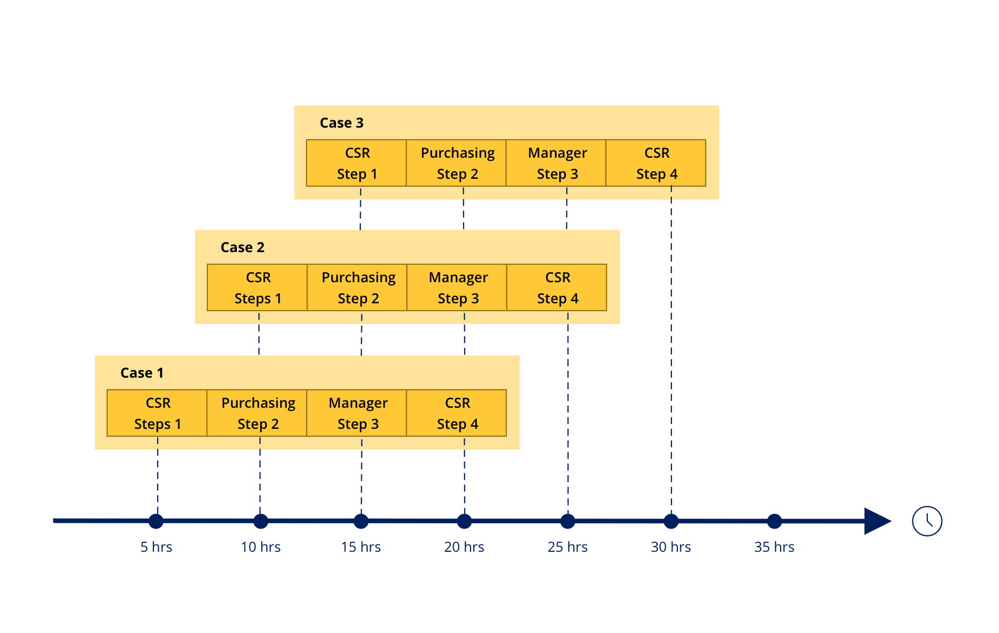
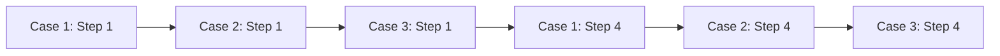

# Completing work on time

- [Completing work on time](#completing-work-on-time)
    - [1. Service-level agreements (SLA)](#1-service-level-agreements-sla)
        - [1.1. Urgency](#11-urgency)
        - [1.2. Types of service-level agreements](#12-types-of-service-level-agreements)
        - [1.3. Work prioritization](#13-work-prioritization)
            - [1.3.1. Urgency-based prioritization](#131-urgency-based-prioritization)
            - [1.3.2. Deadline-based prioritization](#132-deadline-based-prioritization)
        - [1.4. Escalation actions](#14-escalation-actions)

## 1. Service-level agreements (SLA)

- establishes a work completion deadline

Service levels milestone:

- Goal - defines how long the assignment should take
- Deadline - defines the longest amount of time the assignment may take before it is considered "late"

> Both milestone is measured as soon an assignment is started.

### 1.1. Urgency

- a value from `10-100`

- can set urgency for Goal and Deadline
- all assignment starts with a default value of `10` urgency

### 1.2. Types of service-level agreements

| Type             | Start                    | End                                |
| :--------------- | :----------------------- | :--------------------------------- |
| case-level       | case is started          | case is resolved                   |
| stage-level      | case enters stage        | case leaves the stage              |
| process-level    | process is called        | last step in the process completes |
| assignment-level | an assignment is created | after assignment completion        |
| approval-level   | approval is called       | after the approval completion      |

### 1.3. Work prioritization

In PEGA, work is prioritized based on urgency or deadline.

#### 1.3.1. Urgency-based prioritization

1. **Case urgency** - priority of a case.
2. **Assignment urgency** - priority of completing an assignment.

> **Assignment Priority**
>
> - Assignment urgency indicates assignment priority.
> - The **Get Next Work** functionality prioritizes assignments with the highest urgency.

#### 1.3.2. Deadline-based prioritization

Makes SLAs deadline-focused rather than urgency-focused.

### 1.4. Escalation actions

Escalation actions are actions that your application takes to facilitate faster resolution times based on a specified service-level agreement.

Configure SLAs escalation actions to:
- notify the asighnee, manager, and participants
- reassign task
- resolve the case as the goal or deadlines occur
