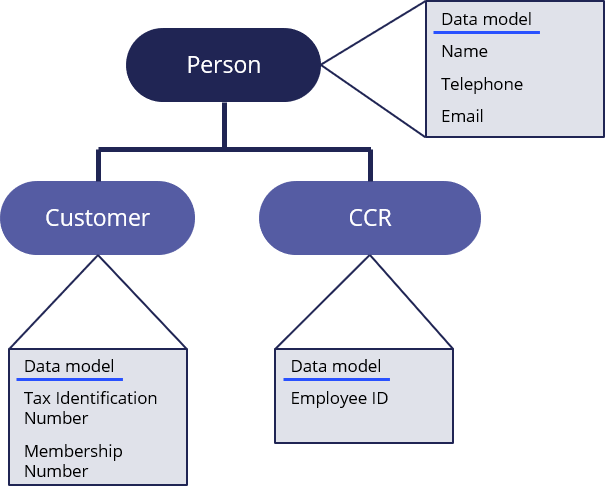
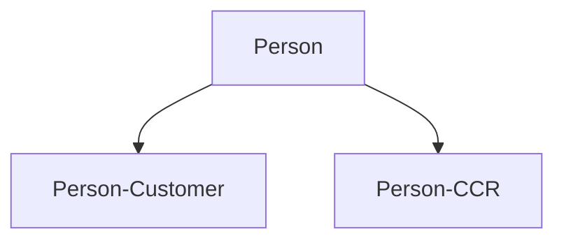
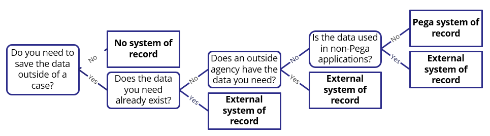
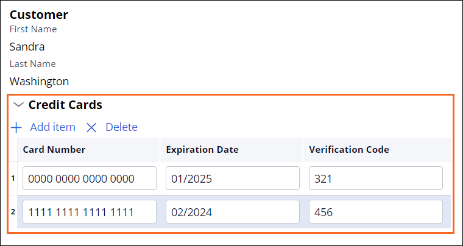

# Creating a data relationship

- [Creating a data relationship](#creating-a-data-relationship)
    - [1. Data objects](#1-data-objects)
        - [1.1. Structure](#11-structure)
        - [1.2. Inheritance](#12-inheritance)
        - [1.3. Sourcing](#13-sourcing)
        - [1.4. Best practices](#14-best-practices)
    - [2. Data relationships](#2-data-relationships)
        - [2.1. Relationships between data objects](#21-relationships-between-data-objects)
        - [2.2. Data relationships with multiple records](#22-data-relationships-with-multiple-records)
        - [2.3. Data in data relationships](#23-data-in-data-relationships)
            - [2.3.1. Field types and data object location](#231-field-types-and-data-object-location)
        - [2.4. Sourcing user-supplied data](#24-sourcing-user-supplied-data)
        - [2.5. Sourcing data users do not supply](#25-sourcing-data-users-do-not-supply)
            - [2.5.1. Reference field types](#251-reference-field-types)

## 1. Data objects

- A template for describing an entity
- can use data objects as many times as needed in your application

### 1.1. Structure

<dl>
    <dt>Data type</dt>
    <dd>represents the tecnical implementation for the data object, such as the names and types of fields used to capture and present information about the entity.</dd>
    <dd>PEGA automatically creates the corresponding data type when you create a data object.</dd>
</dl>

> NOTE:  In Dev Studio, developers work directly with the underlying data type, not with the data object. As a result, you may find the terms data object and data type used interchangeably on projects and documentation.

- data objects can group views and other rules related to the data object.
- you can extend the structure of a data object by referencing other data objects.

### 1.2. Inheritance

- You can create data objects to reuse assets from an existing data object through inheritance.
- Use the **Parent-Child** pattern to denote the relationship between parent and child data objects.

**Parent-Child pattern**

### 1.3. Sourcing

You can source data objects locally from a PEGA SoR, or you can source from an external SoR, like a database.

### 1.4. Best practices

- use standard, commonly-used data objects that PEGA provides (e.g. `Address-Portal` and `Address-Email`)
- if a data object only partially meets your needs, you can extend the data object by inheritance. (e.g. You want an `Employee` data object, you can extend the existing `Person` data object to create the `Person-Employee` data object)
- if a suitable data object does not exist yet, create a new one

> If you add a new data object to the case workflow in App Studio, Pega Platform creates the data object as a draft object. A draft data object does not reference a data type. You can add a data type to a draft data object by using the **Data objects and integrations** page.

## 2. Data relationships

### 2.1. Relationships between data objects

<dl>
    <dt>Data relationship</dt>
    <dd>A container in which you associate a set of related fields</dd>
    <dd>Can be used to create relationship between data objects and cases</dd>
    <dd>Does not store data itself but instead relates data
</dl>

### 2.2. Data relationships with multiple records

You can configure realtionships to reference a **single record** or **multiple records**.

| Type            | References...            |
| --------------- | ------------------------ |
| Single record   | a single set of values   |
| Multiple record | a list of grouped values |

### 2.3. Data in data relationships

- A case type or data object defines the data model for the data relationship.
- You can create a ata relationship either by creating a new data object or by using an existing data object or case type.
- Each data relationship does not have to use all the defined fields, but they are all available.
- A data relationship with multiple records serves as a template for each grouped field instance. Each vaule follows the field type configuration settings.
- You can configure a multiple record data relationship to allow end users to add, delete, or update items as needed.
- A data object can contain other data objects. A data relationship can contain other data relationships.

The `Customer` is a single record that contains `Credit Cards` a multiple record.

#### 2.3.1. Field types and data object location

| Data relationship field type | Data source                                                                                                     |
| ---------------------------- | --------------------------------------------------------------------------------------------------------------- |
| Embedded data                | Sourced inside a case                                                                                           |
| Query                        | Sourced outside a case. The data page defines parameters that the Query data relationship is configured to use. |
| Case reference               | Single or multiple records from a selected case type                                                            |
| Data reference               | Sourced outside a case. Single or multiple records from a selected data page.                                   |

### 2.4. Sourcing user-supplied data

Use an **Embedded data** field when data is sourced from a user interaction that is made inside a case type.

### 2.5. Sourcing data users do not supply

- In PEGA, a **data page** retrieves data from a specified data source and caches that data in memory
- A **Query** field type is used to define a field that the system can use to consistently access data sourced outside of the case

#### 2.5.1. Reference field types

* Consider the **Case reference** and **Data reference** field types as specialized versions of the **Query** field type, used to define a selectable item or list of explicitly referenced items by their identifier or key
* Reference field types are used to show a user a list of options they can choose from.
* Most use cases for savable data pages use a Reference field type but could also use the Query field type.

> <dl>
>   <dt>Embedded data</dt>
>   <dd>reference user data inside the case</dd>
> </dl>
>
> <dl>
>   <dt>Query</dt>
>   <dd>reference data outside the case using a data page for configuration
> </dl>
>
> <dl>
>   <dt>Case reference</dt>
>   <dd>reference another case type</dd>
> </dl>
>
> <dl>
>   <dt>Data reference</dt>
>   <dd>reference data outside the case</dd>
>   <dd>mostly used for savable data page</dd>
> </dl>