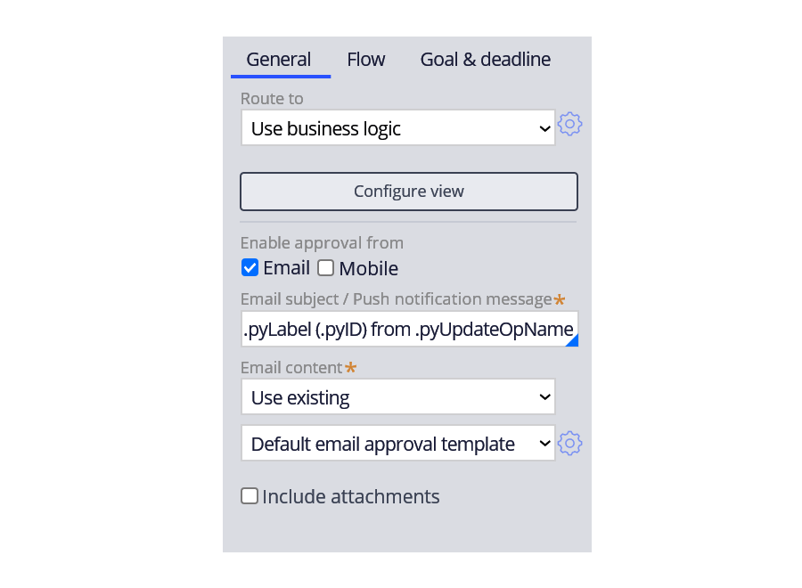
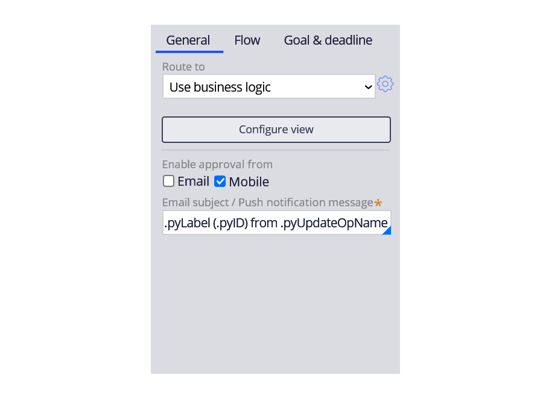
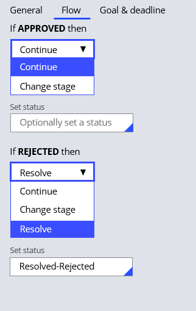

# Designing an approval process

- [Designing an approval process](#designing-an-approval-process)
    - [1. Work approval](#1-work-approval)
        - [1.1. Case approvals](#11-case-approvals)
        - [1.2. The Approve/Reject step](#12-the-approvereject-step)
        - [1.3. Routing](#13-routing)
        - [1.4. Routing notifications](#14-routing-notifications)
        - [1.5. Flow](#15-flow)

## 1. Work approval

### 1.1. Case approvals

are decision points at which one or more users decide whether to approve or reject a case.

### 1.2. The Approve/Reject step

To configure an Approve/Reject step, you define who is assigned to the approval and how the case proceeds if the case is approved or rejected. To achieve this, you configure the Approve/Reject step routing and flow.

### 1.3. Routing

You can assign approvals to different routing options (e.g. specific user, work queue, and business logic)

### 1.4. Routing notifications

**Email notification**

If the email approval option is enabled, when the case reaches the approval step, the application sends an email to the user or users specified by the step routing.

**Mobile notification**

If the mobile approval is enabled, the application pushes an approval notification to a mobile device.

### 1.5. Flow

You configure the consequences of approval and rejection by defining the flow.

You can configure approvals to automatically:

- continue the case
- change to a specific stage
- change the case status

You can configure rejections to automatically:

- resolve a case
- continue the case
- change to a specific stage

