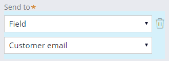

# Sending emails during case processing

- [Sending emails during case processing](#sending-emails-during-case-processing)
    - [1. Email correspondence](#1-email-correspondence)
        - [1.1. Communicating with users](#11-communicating-with-users)
        - [1.2. Identify users with whom to communicate](#12-identify-users-with-whom-to-communicate)
        - [1.3. Identify how to compose the correspondence](#13-identify-how-to-compose-the-correspondence)
        - [1.4. Identify when to communicate with users](#14-identify-when-to-communicate-with-users)
    - [2. Additional tasks for sending email during case processing](#2-additional-tasks-for-sending-email-during-case-processing)
        - [2.1. Sending email notifications from cases](#21-sending-email-notifications-from-cases)

## 1. Email correspondence

### 1.1. Communicating with users

PEGA can send automated email correspondence to all relevant parties.

### 1.2. Identify users with whom to communicate

- You can send correspondence to a specific email address.
- This option depends on a consistent email address.
- To avoid recurring changes to an email address, you can use fields, participants, and user references to send email correspondence.

**Fields**

You can send an email based on the value of a field.

**Participants**

You can also use participant information to send correspondence to a group of stakeholders.

PEGA's default participants for correspondence:

| Participant | Description                                                              |
| ----------- | ------------------------------------------------------------------------ |
| Owner       | The person who created the case                                          |
| Customer    | The person on whose behalf the case is transacted                        |
| Interested  | A person who tracks the progress of a case but does not process the case |

> You can also send email correspondence to all participants.

**User references**

In cases where the correspondence needs to be sent to one specific user in your application, you can use a user reference. 

### 1.3. Identify how to compose the correspondence

- PEGA provides a rich text editor to create formatted email correspondence.
- The editor allows you to reuse data from the case in the email. 
- You can also use existing correspondence templates.

### 1.4. Identify when to communicate with users

**Send email automation**

- Pega Platform simplifies sending correspondence by allowing you to add a Send email automation to your case to send an email.
- When a case reaches the Send email step, the email is automatically sent to the selected parties.

**Case level notifications**

- allows you to automatically send a notification when an assignment in the case is routed to a user worklist. 
- are automatically configured to send to the user associated with the worklist.

> If the message is left blank, the default message is used: `.pyLabel + "(" + .pyID + ") moved to your worklist"`

> Notifications are only sent once the case enters the routed assignments.

## 2. Additional tasks for sending email during case processing

### 2.1. Sending email notifications from cases

Di ko alam pano gagawan ng reviewer to: [module reference](https://academy.pega.com/topic/additional-tasks-sending-email-during-case-processing/v3/in/29826/29936/30836)

---

  <a href=[1.9]%20Designing%20an%20approval%20process.md>⬅️PREVIOUS</a>

