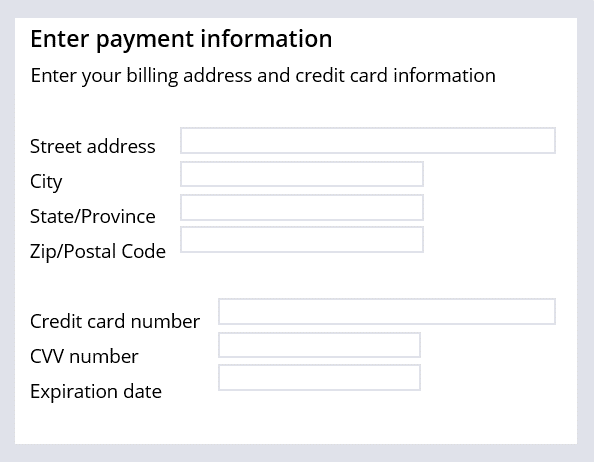

# User guidance

- [User guidance](#user-guidance)
  - [1. Case status](#1-case-status)
    - [1.1. The appropriate case status value](#11-the-appropriate-case-status-value)
    - [1.2. Case status updates](#12-case-status-updates)
  - [2. Assignment instructions](#2-assignment-instructions)
    - [2.1. Instructions](#21-instructions)

## 1. Case status

- Indicates the progress of a case towards resolution
- can set status on any stage and step in the case life cycle

### 1.1. The appropriate case status value

- must be consistent across case types
- have no more than 10 case statuses in a case type
- use the prefix `New`, `Open`, `Pending`, or `Resolved`

### 1.2. Case status updates

If you set a cases status on a **stage**, PEGA automatically updates the case status when the case advances to the stage. The same goes for setting a case status on a **step**.

## 2. Assignment instructions

### 2.1. Instructions

- Step instructions identify what users must accomplish in that assignment.
- Add instructions to steps that require users to enter information.

---

  <a href=[1.2]%20Defining%20a%20customer%20Microjourney.md>⬅️ PREVIOUS</a>
  |
  <a href=[1.4]%20Completing%20work%20on%20time.md>NEXT ➡️</a>

