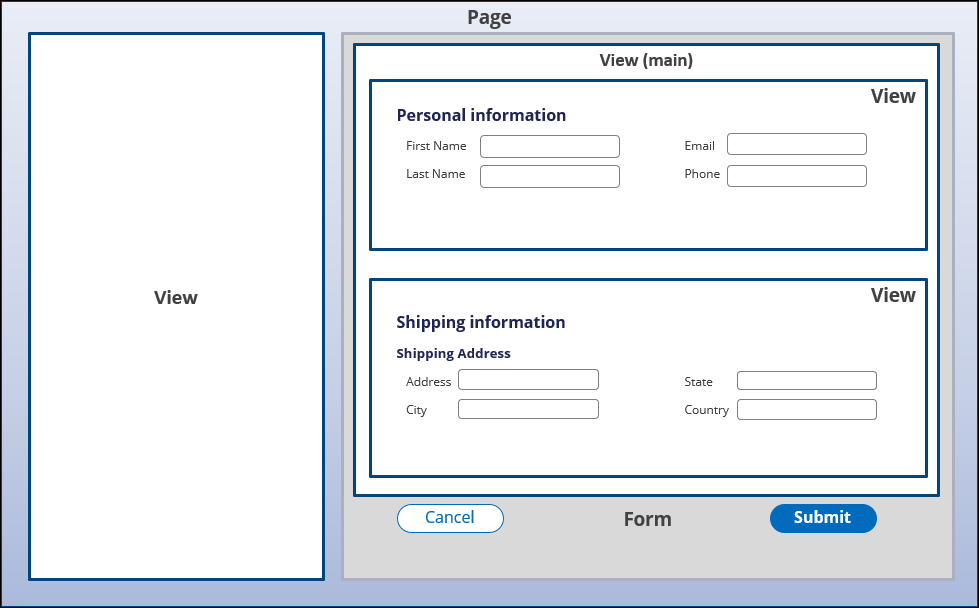

# Capturing and presenting data

- [Capturing and presenting data](#capturing-and-presenting-data)
    - [1. Fields](#1-fields)
        - [1.1. Simple field types](#11-simple-field-types)
        - [1.2. Fancy field types](#12-fancy-field-types)
    - [2. Views](#2-views)
        - [2.1. Views for specific tasks](#21-views-for-specific-tasks)
        - [2.2. View considerations](#22-view-considerations)
        - [2.3. Views versus forms](#23-views-versus-forms)
    - [3. Calculated values](#3-calculated-values)
        - [3.1. Relationships between fields](#31-relationships-between-fields)
        - [3.2. Functions](#32-functions)
        - [3.3. Expressions](#33-expressions)
        - [3.4. Decision tables](#34-decision-tables)
        - [3.5. Calculation networks](#35-calculation-networks)

## 1. Fields

- can collect information from users or present case information for review.
- named and reusable UI component
- each field stores a unique value that is associated with a case
- field name and the stored value defines a data element `(field name + stored value = data element)`

**Field type**

- When you create a field, you also assign a field type
- identifies the type of information stored in the system

### 1.1. Simple field types

| Type               | Data type                                           |
| ------------------ | --------------------------------------------------- |
| Text (single-line) | single line of text                                 |
| Text (paragraph)   | multiple lines of text                              |
| Boolean            | true or false                                       |
| Currency           | currency symbol + value                             |
| Date & time        | Time only + Date only                               |
| Date only          | Calendar date in local format                       |
| Decimal            | numbers with a fractional component                 |
| Email              | valid email format with an `@` symbol               |
| Integer            | +/- whole numbers, including zero                   |
| Percentage         | decimal numbers displayed as percentage             |
| Picklist           | list of predefined values                           |
| Time only          | UTC value normalized to GMT                         |
| URL                | web address                                         |
| User reference     | enter or select a user ID that exists in the system |

### 1.2. Fancy field types

| Type       | Data type                              |
| ---------- | -------------------------------------- |
| Attachment | document or file                       |
| Location   | Address input or automatic geolocation |

## 2. Views

- displays the fields necessary to complete the current assignment
- a component of the UI that gathers or display information

### 2.1. Views for specific tasks

You can create views for each specific tasks.

### 2.2. View considerations

During view creation, you determine the information that users need to see or collect to perform specific tasks.

- **Field name** - label for the field. What the users see?
- **Field type** - data type for the field input. How does the user enter the values?
- **Edit options** - are the fields editable or read-only?

> You can mark any field as Optional, Read-only, Requred, or Calculated (Read-only)

### 2.3. Views versus forms

**View**

- reusable configuration of UI elements that you can use to interact with a case
- not always a form

**Form**

- interface for collecting data from users and processing the work
- can have one or more views

## 3. Calculated values

### 3.1. Relationships between fields

A calculation expresses a relationship between fields by setting the value of a calculated field based on one or more input fields.

Three types of calculations:

1. **Functions** - iterate over items in a list
2. **Expressions** - calculate a field value by referencing fields and data relationships
3. **Decision tables** - use a set of conditioni to test property values and return an appropriate response

### 3.2. Functions

Iterate over items in a data relationship and are supported for Decimal, Currency, and Integer field types.

Four basic functions used in calculations:

1. Sum of
2. Average of
3. maximum of
4. Minimum of

### 3.3. Expressions

- Calculate the fields by using any number of simple fields, fancy fields, or data relationship values.
- you reference fields by name using the period character prefix (`.`)
- can be used to concatenate strings

Expressions support common operations, such as:

1. Addition
2. Subtraction
3. Multiplication
4. Division
5. Grouping
6. Boolean AND
7. Boolean OR

### 3.4. Decision tables

evaluate the value of one or more fields with a set of logical tests to return an appropriate result.

### 3.5. Calculation networks

- PEGA establishes and updates a network of calculations for an application
- when you defined a calculated field, PEGA adds the calculated field the the calculation network
- updates all relevant fields whenever a value changes
