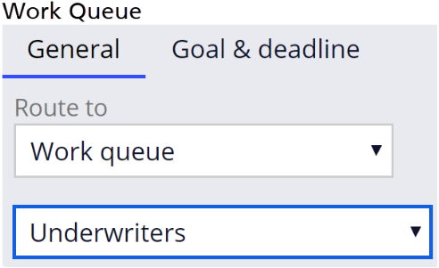

# Routing assignments to users

- [Routing assignments to users](#routing-assignments-to-users)
    - [1. Routing work](#1-routing-work)
        - [1.1. Routing options](#11-routing-options)
            - [1.1.1. Current user](#111-current-user)
            - [1.1.2. Specific user](#112-specific-user)
            - [1.1.3. Work queue](#113-work-queue)
            - [1.1.4. Business logic](#114-business-logic)

## 1. Routing work

When there is more than one operator to copmplete work on a case, you define who performs the work on each assignment as you model a process.

### 1.1. Routing options

#### 1.1.1. Current user

Route an assignment to the current user if the user who completed the preceding assignment needs to complete the current task.

#### 1.1.2. Specific user

A **worklist** is a list of all open assignments, in order of importance, for a **specific user**.


#### 1.1.3. Work queue

<dl>
    <dt>Work group</dt>
    <dd>identifies a cross-functional team that uses a work queue to distribute work</dd>
</dl>

<dl>
    <dt>Work queue</dt>
    <dd>a list of all open assignments, in order of importance, for a group of users.</dd>
</dl>

> ```
> In PEGA:
>   Work groups = teams
>   Operators   = team members
> ```



#### 1.1.4. Business logic

- You configure conditional routing by using business logic when you want to route work based on certain conditions.
- You can create multiple conditions


