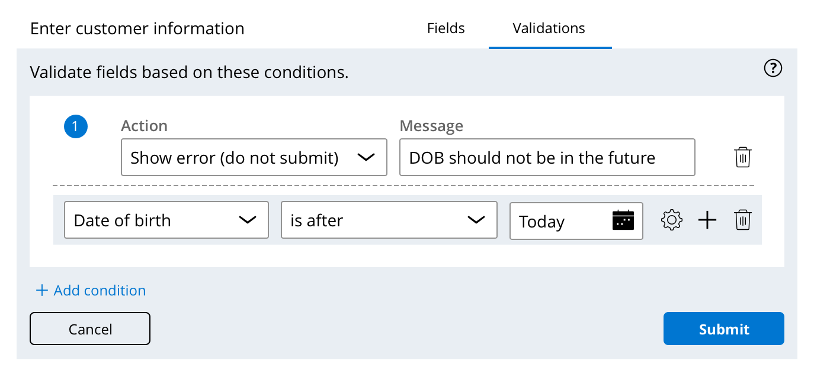
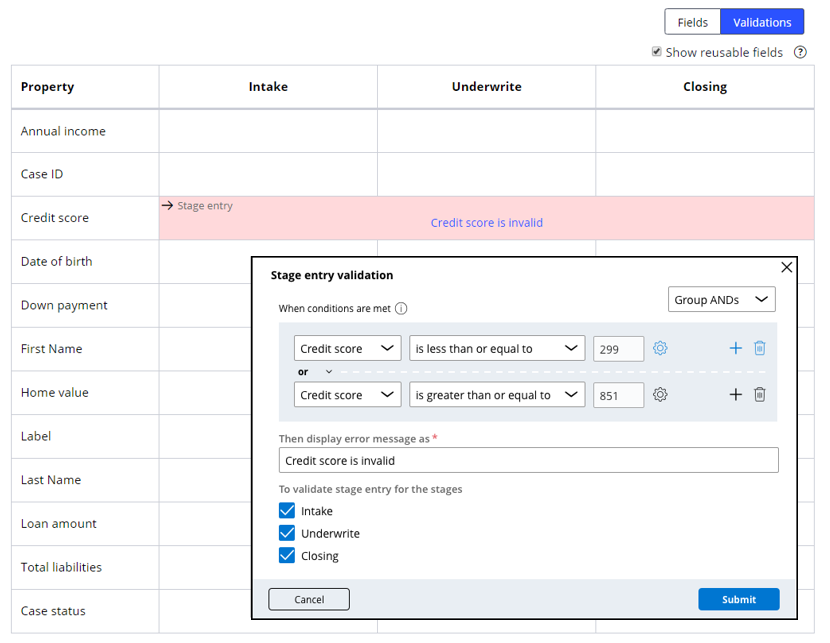

# Validating data against business logic

- [Validating data against business logic](#validating-data-against-business-logic)
    - [1. Data validation](#1-data-validation)
        - [1.1. Methods of data validation](#11-methods-of-data-validation)
        - [1.2. Business logic data validation](#12-business-logic-data-validation)
        - [1.3. Validation on a form](#13-validation-on-a-form)
        - [1.4. Validation on a stage](#14-validation-on-a-stage)

## 1. Data validation

### 1.1. Methods of data validation

- When you design a view, you add all the fields and controls that the specification requires.
- You must also consider how to ensure that the data values generated by users are valid.
- Valid data is required so that the system can process the information without error. 
- To prevent processing errors, PEGA provides field types and controls to support validation requirements. 
- Choosing the right control may be sufficient to satisfy a validation requirement.
- In cases where a control or field type is insufficient to perform data validation, Pega provides data validation by using business logic to test fields with conditions. 

    > For example, you can use a calendar control to ensure that the data entered by users is a date, regardless of whether the format is dd/mm/yyyy or mm/dd/yyyy. But you cannot use a calendar control to ensure that a Start date field in an employment history form captures a date in the past. Instead, you can validate the date is in the past using business logic.

### 1.2. Business logic data validation

- You use App Studio to perform simple business logic validations that compare the value of a field against a constant value when users submit a form
-  You create conditions that define ***invalid data values*** so that an error message is displayed when the condition is met and prevents the user from continuing the case until the issue is resolved.
- Business logic validations are often ***associated with processes in the case life cycle***, enabling you to validate ***each field instance*** based on distinct business logic validations.

    >  For example, a Date of birth field is validated when users enter the date on the field. The validation is not applied again when the field is used later during case processing.

- In App Studio, you can validate the value of a field when you **submit a form** or when **the case enters a stage**

### 1.3. Validation on a form

- You use business logic validations on a form when you cannot predict or control the value that users enter.
- Use validation on a form when users can perform an immediate action to resolve the invalid data, such as entering a new value in a field

### 1.4. Validation on a stage

- You can also use business logic validation on a stage.
- Use business logic validation on a stage to ensure the application has generated the correct data and that users have entered the correct data or performed the appropriate actions before the case enters a specific stage.

    > **Note**: When an error message is triggered on a stage validation, end users need to have the ability to update invalid data or perform an action, such as returning to a previous stage or closing the case. It is up to the developer to configure the functionality that allows end users to resolve the validation error.

---

    <a href="[2.9] Pausing and resuming case processing.md">⬅️PREVIOUS</a>
    |
    <a href="[2.11] Exploring application data with insights.md"> NEXT➡️</a>

