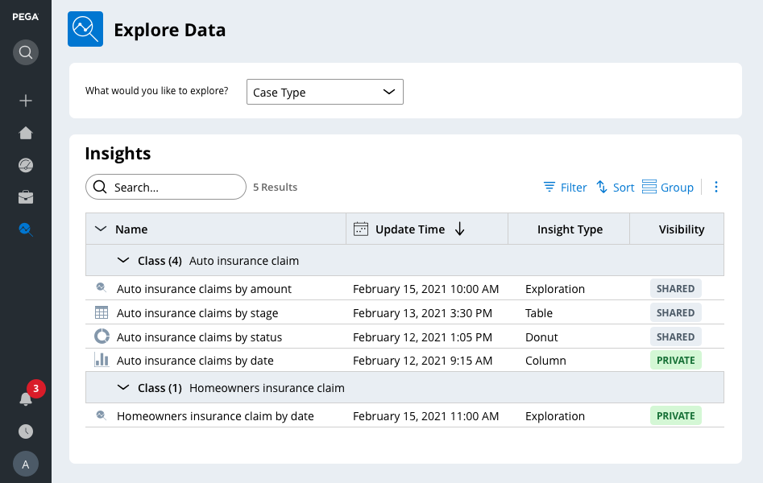
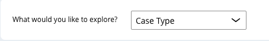
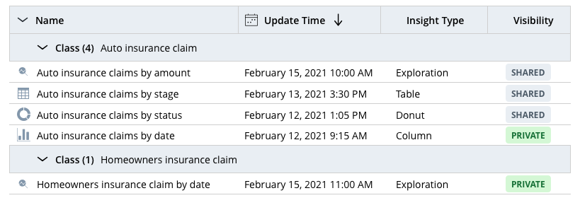
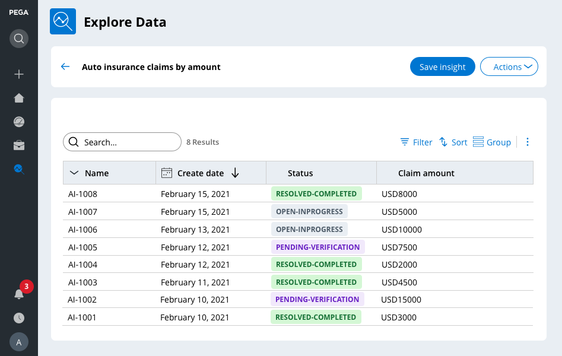
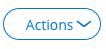
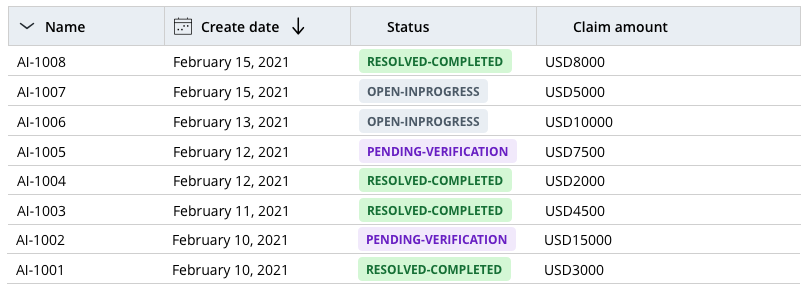
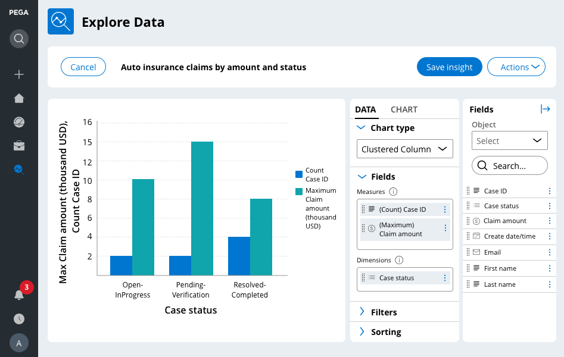
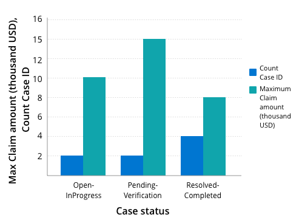
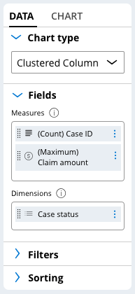
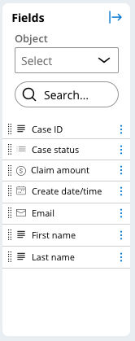

# Exploring application data with Insights

- [Exploring application data with Insights](#exploring-application-data-with-insights)
    - [1. The Explore Data landing page](#1-the-explore-data-landing-page)
        - [1.1. Insights](#11-insights)
        - [1.2. Layout of the Explore Data landing page](#12-layout-of-the-explore-data-landing-page)
            - [1.2.1. View or modify an insight](#121-view-or-modify-an-insight)
            - [1.2.2. Create a chart from an insight](#122-create-a-chart-from-an-insight)

## 1. The Explore Data landing page

The Explore Data landing page allows you to explore and analyze data in your application quickly

On the Explore Data landing page, you can:

- query your data
- sort
- filter
- group the results
- access the list of assignments that are routed to members of your team
- drill down and analyze the assignment statuses to determine the remaining workload for the current release
- save queries as **insights**.

### 1.1. Insights

- Insights are rules that PEGA uses to transform data queries into tables or visualizations that you can then share between users
- You can use insights to retrieve specific data and present the data as a list or an interactive chart

### 1.2. Layout of the Explore Data landing page

The Explore Data Landing page displays a list of previously-created insights.

- <dl><dt>Explore data</dt>
    <dd>You can select a type of data for which you want to create an insight.</dd></dl>

    

- <dl><dt>Organize insights</dt>
    <dd>You can filter, sort, or group insights to display the insights of interest.</dd></dl>

    

- <dl><dt>Access insights</dt>
    <dd>You have access to previously-created insights for your application.</dd></dl>

    

#### 1.2.1. View or modify an insight

On the Explore Data landing page, you can select a previously-created insight to view or modify.

- <dl><dt>Save an insight</dt>
    <dd>You can create customized insights that you can use throughout the application.</dd></dl>

    

- <dl><dt>Perform an action on an insight</dt>
    <dd>From the <strong>Actions</strong> menu, you can export application data to Excel, delete an insight, or add interactive charts. You can choose from several chart types (such as pie, bar, donut, or column).</dd></dl>

    

- <dl><dt>View data based on business needs</dt>
    <dd>You can filter, sort, or group data to view only the specific information that matches your business needs.</dd></dl>

    

- <dl><dt>Customize columns</dt>
    <dd>From the <strong>More</strong> menu, you can hide, display, freeze, or resize columns.</dd></dl>

    

- <dl><dt>Access application data</dt>
    <dd>You have access to your application data, such as detailed information about assignments, bugs, and work items</dd></dl>

    

#### 1.2.2. Create a chart from an insight

On the Explore Data landing page, you can create charts from an insight to visualize your data.

- <dl><dt>Chart preview</dt>
    <dd>Chart settings are immediately displayed.</dd></dl>

    

- <dl><dt>Data tab</dt>
    <dd>In the <strong>Data</strong> tab, you can select the chart type, add data fields, filter fields, and sort the data depicted in the chart.</dd></dl>

    

- <dl><dt>Chart tab</dt>
    <dd>On the <storng>Chart</strong> tab, you can control the presentation of the chart by customizing the axes, adding reference lines and regions, customizing the chart legend, displaying tooltips, and adding conditional formatting.</dd></dl>

    <!-- TODO: Chart tab ss -->

- <dl><dt>Fields pane</dt>
    <dd>In the <strong>Fields</strong> pane, you can select and search for fields.</dd>
    <dd>Drag <strong>fields</strong> from the <strong>Fields</strong> pane and drop them to the <strong>Measures</strong>, <strong>Dimensions</strong>, and <strong>Filters</strong> boxes in the <strong>Data</strong> tab.</dd></dl>

    

---

    <a href="[2.10] Validating data against business logic.md">⬅️PREVIOUS</a>
    |
    <a href="[2.12] Gaining insight into business efficiency.md"> NEXT➡️</a>

