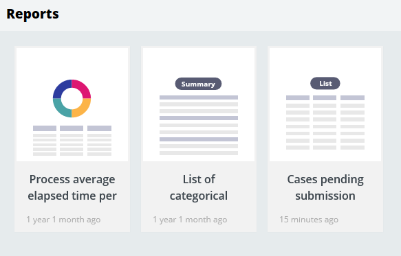

# Gaining insight into business efficiency

- [Gaining insight into business efficiency](#gaining-insight-into-business-efficiency)
    - [1. The Report Browser](#1-the-report-browser)
        - [1.1. Standard Pega Public report categories](#11-standard-pega-public-report-categories)
            - [1.1.1. Analyze performance](#111-analyze-performance)
            - [1.1.2. Analyze quality](#112-analyze-quality)
            - [1.1.3. Case metrics](#113-case-metrics)
            - [1.1.4. Monitor assignments](#114-monitor-assignments)
            - [1.1.5. Monitor process](#115-monitor-process)
            - [1.1.6. Open cases](#116-open-cases)
            - [1.1.7. Service level performance](#117-service-level-performance)
            - [1.1.8. Step performance](#118-step-performance)
            - [1.1.9. Predictive Model Monitoring](#119-predictive-model-monitoring)
    - [2. Reports](#2-reports)
        - [2.1. Business and process metrics](#21-business-and-process-metrics)
            - [2.1.1. Business metrics](#211-business-metrics)
            - [2.1.2. Process metrics](#212-process-metrics)
        - [2.2. The role of reports](#22-the-role-of-reports)
        - [2.3. Report structure](#23-report-structure)
            - [2.3.1. Columns](#231-columns)
            - [2.3.2. Filters](#232-filters)

## 1. The Report Browser

- You use the **Report Browser** tool to create new reports, organize, run, and share reports as well as manage report categories.

**Category**

- PEGA organizes reports by category.
- A **category** defines an organizational framework for reports displayed in the Report Browser
- Each category consists of a label and an owner type that exposes the category to a specific audience: an individual user, a group of users, or all users.
- The two types of categories are private and public.

| Type    | Usage                                                                                                                                                                                                     |
| ------- | --------------------------------------------------------------------------------------------------------------------------------------------------------------------------------------------------------- |
| Private | provide shortcuts to reports that you create. Other users cannot run or view these reports.                                                                                                               |
| Public  | provide shortcuts to standard Pega out-of-the-box reports that provide deep insight around the volume, process, and efficiency for case resolution as well as reports that users made available to others |

The Report Browser displays reports as visual tiles that provide a preview of the type of report. 

- The first row of tiles shows reports recently open by the user.
- Each tile includes a time period that indicates the amount of time elapsed since the report's creation.
- you can choose between viewing all available reports or the reports you create.
- You can also alternate between tile and list views.
- you can perform text- and category-based searches.

### 1.1. Standard Pega Public report categories

PEGA populates and sorts standard reports into the following Public categories:

#### 1.1.1. Analyze performance

- Reports in the **Analyze Performance** category analyze and summarize resolved (completed) work items along quality dimensions.
- You can use these reports to review past performance and identify areas that might be improved.

#### 1.1.2. Analyze quality

- Reports in the **Analyze Quality** category identify, by assignment, which actions were selected, how often, and the timeliness of the selection.

#### 1.1.3. Case metrics

- Reports in the **Case Metrics** category provide information about open and resolved cases, and historical views of step performance.
- Two reports are in the case metrics category — **Time per stage** and **Case Volume**.

| Report          | Description                                                                                                                                          |
| --------------- | ---------------------------------------------------------------------------------------------------------------------------------------------------- |
| Timer per stage | provides a stacked bar chart of resolved cases by stage with the length of the bar representing the length of time spent in each status by work type |
| Case volume     | provides the cases created per day grouped by case types for the last seven days                                                                     |

#### 1.1.4. Monitor assignments

- Reports in the **Monitor Assignments** category provide information about open assignments. 

#### 1.1.5. Monitor process

- Reports in the **Monitor Processes** category list or summarize open (unresolved) work items in the current application.
- These reports support day-to-day monitoring of the business processes that are supported by your application

#### 1.1.6. Open cases

- Reports in the **Open Cases** provide the case-level service level agreement (SLA) status for open cases.

#### 1.1.7. Service level performance

- Reports in the **Service Level Performance** category provide the assignment SLA statuses. 

| Report          | Description                                                                                          |
| --------------- | ---------------------------------------------------------------------------------------------------- |
| User Timeliness | Reports in the Open Cases provide the case-level service level agreement (SLA) status for open cases |
| Step Timeliness | groups the assignment SLA statuses by step                                                           |

#### 1.1.8. Step performance

- Reports in the **Step Performance** category provide the status of process steps.
- The Step Performance category includes the following reports.

| Report                      | Description                                                              |
| --------------------------- | ------------------------------------------------------------------------ |
| Goals and deadlines by step | Provides the SLA status grouped by assignment                            |
| Step duration               | Provides a historical view of the time it took a user to complete a step |
| Time spent in step          | Provides a historical view of the time spent on a particular step        |

#### 1.1.9. Predictive Model Monitoring

- Reports in the **Predictive Model Monitoring** category provide performance information of your predictive models.

## 2. Reports

### 2.1. Business and process metrics

- Business applications often target performance gains in time and efficiency to reduce costs.
- Poor performance, such as long times to complete tasks, may show a poor application design.
- You need ways of understanding how complex processes are functioning to learn where bottlenecks are, where there are opportunities to improve response time, and what emerging trends need attention.
- Data generated by an application can show what is happening, what has happened over time, and whether these results match or differ from your plan.
- Application data can be categorized as either **business metrics** or **process metrics**.

#### 2.1.1. Business metrics

- **Business metrics** measure the success or failure of business processes, and are based on the data you define for an application.
- Organizations can use these business metrics to make informed decisions about improving business performance.

    > Examples include the number of orders for a certain item, or how many cancellations there are of a certain type of order.

#### 2.1.2. Process metrics

- **Process metrics** measure how work is performed, and are based on data automatically collected by Pega Platform™.
- Process metrics enable business analysts and business managers to discover issues that impact process efficiency.

    > Examples include the time needed to complete an assignment, how often a path is followed in a flow, or the number of Service Level Agreement (SLA) violations.

### 2.2. The role of reports

- Reports present users and managers with business and process metrics, based on the data collected during case processing as a set of database records.
- When designing reports, knowing what information users need and how to use that information is vital.
- Stakeholders can provide you with the requirements necessary to create the required reports.
- Reports can also fetch data to populate user forms with data.

### 2.3. Report structure

- Once you have business requirements, you can configure a report to specify the data from each record that you want to include in the report.
- The report retrieves the data from a database and returns the results in a table of columns and rows.

#### 2.3.1. Columns

- Columns define the content of the report.
- Each column corresponds to a single data element.
- The value in the column can be a value field or property.
- You can format the data value in various ways, such as text, currency, or date.
- You cannot display a data relationship in a column.
- You can use calculations in columns to make reports more useful.

#### 2.3.2. Filters

- A filter defines a test applied to each record to determine whether the record contains data your users need.
- Filters compare a data value in the record against a defined condition.
- If the comparison result is true, the report includes the record. If the comparison result is false, the record is omitted.
- In a filtering condition, the comparison can be an explicit value or the value of a property or field.
- You can also use more complex conditions such as testing values that are greater than a specified threshold, like a date.
    - When you use date or date-time column data in your filter, you can select time periods by using **symbolic dates**.
    - **Symbolic dates** let you select time periods or dates without having to build functions.
- Sometimes you may need to create a more complex filter to capture multiple filtering conditions.
    - You can use multiple filters by adding AND/OR conditions. 
