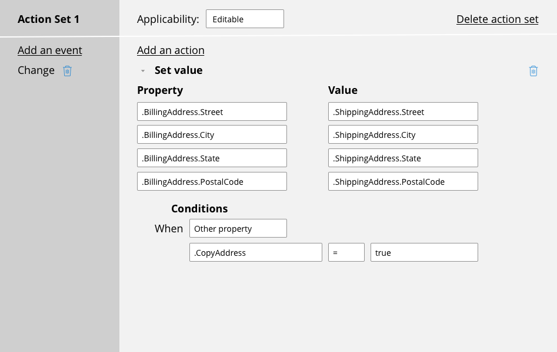

# Customizing UI elements

- [Customizing UI elements](#customizing-ui-elements)
    - [1. Controls and presentation](#1-controls-and-presentation)
        - [1.1. User interface elements in Pega Platform](#11-user-interface-elements-in-pega-platform)
        - [1.2. Styling for basic controls](#12-styling-for-basic-controls)
    - [2. Dynamic functionality on UI elements](#2-dynamic-functionality-on-ui-elements)
        - [2.1. Dynamic UI design](#21-dynamic-ui-design)
        - [2.2. Dynamic attributes for UI elements](#22-dynamic-attributes-for-ui-elements)
            - [2.2.1. Visible](#221-visible)
            - [2.2.2. Disabled](#222-disabled)
            - [2.2.3. Required](#223-required)
    - [3. Event processing with action sets](#3-event-processing-with-action-sets)
        - [3.1. The event-action model](#31-the-event-action-model)
        - [3.2. Action sets](#32-action-sets)
        - [3.3. Action set optimization](#33-action-set-optimization)
            - [3.3.1. Consolidating actions in the action set](#331-consolidating-actions-in-the-action-set)
            - [3.3.2. Differentiating between post and refresh section actions](#332-differentiating-between-post-and-refresh-section-actions)

## 1. Controls and presentation

User interface elements (such as text inputs and layouts) present information and actionable items on the user interface. 

### 1.1. User interface elements in Pega Platform

The UI elements of PEGA include basic controls that you can use out of the box, including:

- Autocomplete controls
- Buttons
- Charts
- Check boxes
- Drop-down lists
- Links
- Sliders
- Rich-text editors

> Note: Avoid using icons for controls. Use link text or a button for clarity and ease of localization.

- You can reuse and customize UI elements as needed by applying existing styling to enable developers to manage controls and styling separately.
- Out-of-the-box UI elements, such as a basic button, come with predefined **style formats**.
- Predefined or out-of-the-box button and label formats are pulled from the **application skin**.
- A Pega Platform best practice is to use existing style formats unless you have an experienced UI developer that can modify existing or create new style formats

> 
> 
> The predefined style formats for a button include **Standard**, **Simple**, and **Strong**.

### 1.2. Styling for basic controls

Presentation and styling are defined for a specific control.

- Depending on the control type, you can style different aspects of the control. 
- Some controls allow you to change the presentation of the label or caption.
- Provide each control with a clear and distinctive label.

## 2. Dynamic functionality on UI elements

### 2.1. Dynamic UI design

Dynamic UI design is the practice of designing a user interface to adapt according to user input. 

- When designing a dynamic user interface (UI), you control the fields that users see and interact with, according to specified conditions.
- The benefits of using dynamic UI design include:
    -  real-time response to end-user behavior
    -  robust functionality available for most user interactions
    -  reduced visual clutter on the screen
    -  and fewer full-page refreshes which results in improved UI responsiveness

### 2.2. Dynamic attributes for UI elements

To configure dynamic behavior for UI elements, you can manipulate when elements are visible and disabled.

#### 2.2.1. Visible 

Configure the visibility of a field or layout to display the field or layout when a specific condition is satisfied.

- By default, UI elements have a visibility setting of Always, meaning the UI element always displays on screen. 

**Visibility options**

| Setting                | UI Element Behavior                                                                                                                                                |
| ---------------------- | ------------------------------------------------------------------------------------------------------------------------------------------------------------------ |
| Always                 | Always display                                                                                                                                                     |
| Condition (expression) | Displays when an **expression** (can be a when rule) returns `true`. Use this option for short expressions that you **do not need to reuse** throughout your case. |
| Condition (When rule)  | Displays if a **when rule** returns `true`. Use this option for more complex when rules or for **when rules you reuse** throughout the case type                   |
| If not blank           | Displays if the value of the field is not **blank**                                                                                                                |
| If not zero            | Displays if the value of the field is not **zero**                                                                                                                 |

#### 2.2.2. Disabled

Configure when a field or layout is disabled to limit user access to a field.

- A field or layout is disabled when a specific condition is satisfied.
- By default, UI elements are never disabled, meaning users always have access to the UI elements. 

**Disable options**

| Setting                | UI Element Behavior                                                 |
| ---------------------- | ------------------------------------------------------------------- |
| Never                  | Never disabled                                                      |
| Always                 | Always disabled                                                     |
| Condition (expression) | Disabled when an **expression** (can be a when rule) returns `true` |
| Condition (when rule)  | Disabled if a **when rule** returns `true`                          |

#### 2.2.3. Required

Configure when a field or layout is required to ensure that a user specifies a value.

- A field or layout is required when a specific condition is satisfied.
- By default, UI elements are never required, meaning the user can proceed with case processing without specifying a value

**Required options**

| Setting                | UI Element Behavior                                           |
| ---------------------- | ------------------------------------------------------------- |
| Never                  | Never required                                                |
| Always                 | Always required                                               |
| Condition (expression) | Required when an expression (can be a when rule) returns true |
| Condition (when rule)  | Required if a when rule returns true                          |

## 3. Event processing with action sets

A user interface (UI) can include controls that allow users to perform certain actions before submitting a form to provide a more interactive user experience.

### 3.1. The event-action model

Actionable controls are based on an event-action model, which establishes a cause-and-effect relationship for a control such as a check box or a button.

- The **event** is a trigger caused by user activity, such as a button click or field entry.
- The **action** is a response by the application, such as creating a case or displaying information about a field to guide user input.

### 3.2. Action sets

In a PEGA application, you use an **action set** to configure an actionable control.

- An **action set** consists of one or more events and one or more actions.
- Optionally, you can add conditions to each action so that the action occurs only when the conditions are met.

**Action set screen**

- <dl><dt>Identifier</dt>
    <dd>Identifies the action set</dd>
    <dd>Action sets are evaluated in <strong>numerical order</strong>, starting with Action Set 1.</dd></dl>

    

- <dl><dt>Applicability</dt>
    <dd>Determines when the action set is applied.</dd>
    <dd>Action sets can be configured for use only when a field is in an <strong>editable state</strong>, <strong>read-only state</strong>, or <strong>both states</strong>.</dd></dl>

    

- <dl><dt>Event</dt>
    <dd>The trigger for the action set.</dd>
    <dd>Events are organized into three categories:
    <ul><li><strong>Mouse events</strong>: events triggered by one of the following actions performed with a mouse or other pointing device</li>
    <li><strong>Keyboard events</strong>: events triggered by pressing one of the following keys on the keyboard</li>
    <li><strong>Other events</strong>: events that do not fall into another category</li></ul></dd></dl>

    

- <dl><dt>Action</dt>
    <dd>The action or actions performed when the specified event occurs.</dd>
    <dd>An action may require that you provide values for needed parameters.</dd>
    <dd>If an action set lists multiple actions, actions occur in the order listed, <strong>starting with the topmost action in the action set</strong>. Any implicit action triggered by a listed action is completed before the system moves on to the next action.</dd></dl>

    

- <dl><dt>Conditions</dt>
    <dd>Any conditions that must be met before the action occurs.</dd>
    <dd>Multiple conditions can be combined using either a boolean `AND` or `OR` operator.</dd></dl>

    

### 3.3. Action set optimization

When configuring an action set, consider how the user experience and data are affected by refresh actions and calls to the server. 

**Refresh a section when**:

- Property values are updated on the server, and the UI needs to reflect the new values.
- An action that causes a change to more than one property that occurs only on the client, such as deleting a row, must be submitted.
- Parts of the UI require removal from the Document Object Model (DOM) because of other input.

**Do not refresh a section when**:

- You need to submit user input. Instead, use a post value action
- You need to call a data transform or an activity after a user action
- You need to recalculate visibility, enabled/disabled state, or read-only state. Select the Evaluate on client check box next to the expression field.

Use a **Refresh When** action whenever possible to declare dependencies.

- To maintain accurate data, use a **Refresh When** action for `read-only` references that need to remain synchronized with data on the server.
- When a Refresh When is not possible, use a **Refresh Other Section** action, which is a targeted refresh. 

#### 3.3.1. Consolidating actions in the action set

Each action in the action set generates at least one HTTP request to the server and runs in the sequential order of configuration.

To optimize the actions and reduce the number of HTTP requests to the server, use the following best practices:

- If the pre-activity or pre-data transform runs in the same context as the section refresh, configure them in the refresh section action.
- Modify the content of your pre-activity if needed when running it in the context of the refresh section.
- Use wrapper activity or wrapper data transform to consolidate all the actions.

#### 3.3.2. Differentiating between post and refresh section actions

By default, a **Refresh section** action sends all the pending changes applied to a form back to the server. There is no need to use a **Post value** action before a refresh section action, such as a **Refresh This Section** action.

> **Note**: The Run activity, Run data transform, and Set value actions do not send the changes made to a form back to the server. If you want to pass some of the changes that are made on a form to an activity or a data transform, you need to pass them as parameters.