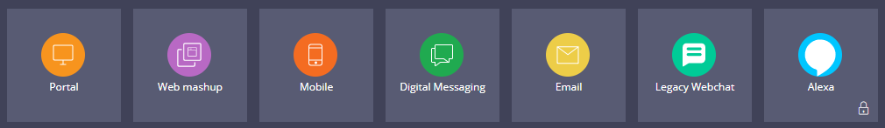

# Customizing portal content

- [Customizing portal content](#customizing-portal-content)
    - [1. Channel interfaces](#1-channel-interfaces)
        - [1.1. Conversational channels](#11-conversational-channels)
        - [1.2. Configure channels](#12-configure-channels)
        - [1.3. Channel configuration on case types](#13-channel-configuration-on-case-types)
    - [2. Portals and landing pages](#2-portals-and-landing-pages)
        - [2.1. Portals](#21-portals)
        - [2.2. Landing pages](#22-landing-pages)
            - [2.2.1. Landing pages menu](#221-landing-pages-menu)

## 1. Channel interfaces

Examples of a **channel** include a messaging service, voice service, web portal, or mobile portal.

- A channel interface allows you to adjust your application to your specific business needs by creating tailored and interactive user interfaces.
- Channels are created from templates that include predefined layouts and navigation for use in your application. 

### 1.1. Conversational channels

Conversational channels help organizations reach additional users. With conversational channels, application users can interact with a PEGA application to obtain help, request a service, and report or solve an issue

**Digital channels**

- Facebook Messenger
- WhatsApp Messenger
- Twitter
- Apple Business Chat
- SMS/MMS (Twilio)
- Embedded chat window
- Amazon Alexa
- Email

Channels also allow users to interact with your application by using **Pega Intelligent Virtual Assistant** (IVA) and **Pega Email Bot**.

- **Pega Intelligent Virtual Assistant** understands intent and conversational language for dynamic conversations with your customers regardless of the channel in which they start or end.

    > You can configure additional IVA functionality through the **Pega API**.

- **Pega Email Bot** can automatically detect the intent of an email and picks up relevant information to automate the processing with a personalized response.

### 1.2. Configure channels

The Channels and interfaces landing page allows you to create, view, and edit all types of channel interfaces.

- You can download new components (such as the Alexa channel component) from **Pega Marketplace** as well.
- The **Lock icon** on a channel indicates that the channel component is not yet added to the application. 

| Channel           | Icon                                    | Description                                                                                                                                                                                                       |
| ----------------- | --------------------------------------- | ----------------------------------------------------------------------------------------------------------------------------------------------------------------------------------------------------------------- |
| Portal            |     | The Portal channel provides a way for you to create a channel interface from templates that include predefined layouts and navigation. Pega Platform has one default Portal — the User Portal.                    |
| Web mashup        |        | The Web Mashup channel provides a way for you to embed part of your Pega Platform content in another application as HTML                                                                                          |
| Mobile            |     | The Mobile channel allows you to build a mobile app for an instance of a Pega Platform application that users can download and install on an Android or iOS device.                                               |
| Digital Messaging |  | The Digital Messaging channel provides a way for users to interact with your Pega Platform application through multiple [digital channels](#11-conversational-channels)                                           |
| Email             |      | The Email channel provides a way for users to use email to create a case.                                                                                                                                         |
| Legacy webchat    |    | The Legacy Webchat channel provides a way for users to chat from an external website to find information, get answers to questions by an automated response, or step through a process such as a case escalation. |
| Alexa             |      | The Alexa channel provides a way for users to use Amazon Alexa voice messages to answer questions or step through a process.                                                                                      |

### 1.3. Channel configuration on case types

You can also create a **channel-specific IVA process** in stages within a case life cycle.

> **Note**: Once you click the More icon on the stage, the Add create process or Add channel process options list only those channels that you have previously added to your application. 

## 2. Portals and landing pages

### 2.1. Portals

A portal is a web channel in use by your application.

- You can use portals to design custom web interfaces for various personas in your application.
- Portals help you to control the content with which each user interacts.
- Depending on the needs of your organization, you can set up a single portal and control the visibility of particular UI elements through personas and access privileges, or create separate portals for individual user groups.
- End users experience the portal through a browser, regardless of device type (such as a desktop or mobile device). 

### 2.2. Landing pages

A portal consists of landing pages that consolidate information for easy access.

- Landing pages allow you to present additional resources to users.
- You can create, configure, and add landing pages to menus within your application to display specific information.
- PEGA provides out-of-the-box landing pages, called **Custom pages**. 

#### 2.2.1. Landing pages menu

You can place a finished landing page within one or several application menus by using the Landing pages menu in App Studio.

You can also add, disable, or manage access to landing pages as well.

- Add landing pages to an existing portal to effectively organize the content of your channel in a main menu.
- Disable an existing landing page that is no longer needed to prevent users from adding the landing page to any menu. 
- Manage access to landing pages by specifying visibility by role. For example, a landing page with employee reviews is visible to only a manager.

> **Tip**: In App Studio, click Design to toggle Design mode, and then click Pages to access the Landing pages menu. The Landing pages menu lists both the pages you created and the Custom pages provided by Pega Platform. Disabled landing pages are not listed.

---

    <a href="[2.13] Customizing a UI element.md">⬅️PREVIOUS</a>
    |
    <a href="[2.15] Customizing a dashboard.md"> NEXT➡️</a>

