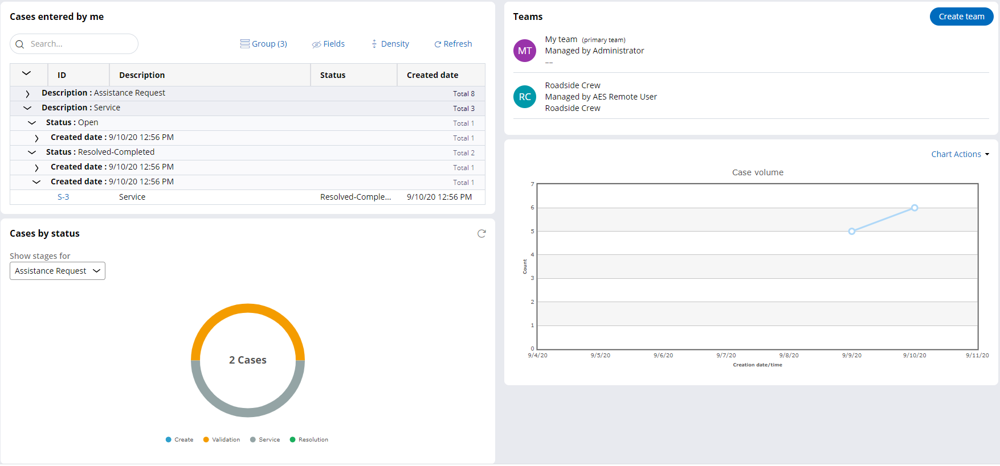
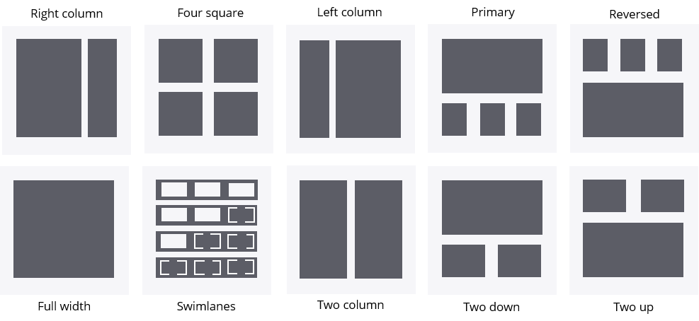

# Customizing a dashboard

- [Customizing a dashboard](#customizing-a-dashboard)
    - [1. Dashboards](#1-dashboards)
        - [1.1. Organization](#11-organization)
        - [1.2. Personalization](#12-personalization)

## 1. Dashboards

**Dashboards** are landing pages that are customizable by end-users.

- Dashboards consist of widgets that consolidate summary information and Key Performance Indicators (KPIs) from different sources and present it in an actionable format.
- Dashboards contain the information necessary for a particular role to help increase productivity.
- By default, PEGA uses role-based interfaces, which includes a dashboard tailored to a role. 

### 1.1. Organization

A template defines the layout of a dashboard and divides the workspace into slots.

- **Slots** are containers for one or more widgets, which are elements of the user interface that display information about the application and KPIs.

### 1.2. Personalization

The default dashboard is assigned based on the user role.

- The developer can configure the dashboard for a role by publishing changes to the default dashboard.
- Then, end users can access the published default dashboard assigned to their role.
    - End users can also personalize the default dashboard by publishing changes to their dashboard instance.
    - If end users personalize a dashboard, the changes that developers publish to a default dashboard do not override or reset the personalized dashboard of end users. 
- PEGA provides various templates that allow developers and end users to organize widgets differently.

**Available templates**

