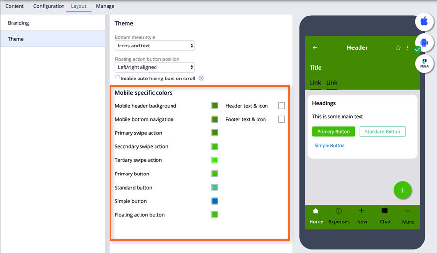

# Designing a mobile app experience

- [Designing a mobile app experience](#designing-a-mobile-app-experience)
    - [1. Mobile app channels](#1-mobile-app-channels)
        - [1.1. Mobile app security](#11-mobile-app-security)
        - [1.2. Mobile app branding](#12-mobile-app-branding)
            - [1.2.1. Icon and launch screen design](#121-icon-and-launch-screen-design)
            - [1.2.2. Theme customization](#122-theme-customization)
    - [2. Additional tasks for designing a mobile app experience](#2-additional-tasks-for-designing-a-mobile-app-experience)

## 1. Mobile app channels

You can use the existing mobile channel to quickly build a consumer-grade app, or modify an app to meet your needs.

- A mobile channel provides developers a way to intuitively configure and customize various aspects of mobile app behavior. 
- The mobile channel is organized into settings logically grouped on the **Content**, **Configuration**, **Layout**, and **Manage** tabs. 
- The channel provides a real-time preview of the app design, tailored to the current tab. 

- <dl><dt>Content tab</dt>
    <dd>controls the content available to users in the mobile app.</dd>
    <dd>used to customize app navigation and functionality by:
    <ul><li>Adding reordering, and removing the default mobile app pages, such as search functionality and notification lists</li>
    <li>Creating customized app content using mobile list pages</li>
    <li>Defining swipe actions for list items to provide users with quick access to common tasks.</li></ul></dd></dl>
- <dl><dt>Configuration tab</dt>
    <dd>controls basic app functionality, such as:
    <ul><li>The app name as displayed on the mobile device.</li>
    <li>The role assigned to users of the mobile app.</li>
    <li>Whether the app supports offline processing.</li>
    <li>App security, including user authentication and session management.</li></ul></dd></dl>
- <dl><dt>Layout tab</dt>
    <dd>controls app branding and styling options, including the launch page and UI element colors.</dd>
    <dd>You can change the default icon, using native icons or custom files for the icon to personalize your app.</dd></dl>
- <dl><dt>Manage tab</dt>
    <dd>controls administrative functions such as log access and administrative push notifications.</dd></dl>
- <dl><dt>Selectable options</dt>
    <dd>The selectable options also change based on the selected tab.</dd></dl>

    

- <dl><dt>Configuration pane</dt>
    <dd>The options and menu items displayed in the configuration pane differ based on the selected tab.</dd></dl>

    

- <dl><dt>Mobile app preview</dt>
    <dd>The mobile channel configuration features a live preview that displays the appearance of the app on a mobile device.</dd>
    <dd>As you make changes, you can observe them in real-time in the **App preview**.</dd></dl>
- <dl><dt>Build an application options</dt>
    <dd>The preview includes three buttons for building and accessing a Pega Mobile application.
      
    <blockquote>The iOS and Android buttons present pages for building a mobile app for the respective platform. Each build option is customized to a specific platform.</blockquote></dd>
    <dd>Click the Pega button to model the channel configuration on a mobile device using the Pega Mobile Preview app. Pega Mobile Preview allows you to access your Pega Platform application on your device as a mobile app for up to 30 days by scanning the provided QR code.
      
    <blockquote>Downloading a native mobile app and previewing an app with Pega Mobile Preview require logging in to Pega Platform over a secure HTTP (HTTPS) connection.</blockquote></dd></dl>

    

### 1.1. Mobile app security

To make your mobile app more secure, you can use the **Security** tab to select an authentication model and configure the locking settings for your app.

- You can also disable authentication requirements for users who want to access the app by selecting a role that determines which users have access to the mobile channel. 

### 1.2. Mobile app branding

You can tailor the app's interfaces to reflect your brand identity. For a professional look and feel and to ensure a consistent user experience across the channels, you can customize the interface to match the branding requirements.

#### 1.2.1. Icon and launch screen design

To ensure that users can easily recognize and find your mobile app, use the Mobile app preview to create a personalized app launch screen and icon, specifying corresponding icons and background colors.

- You can customize the app branding by:
    - uploading an image
    - selecting from a list of font icons
    - or using the default text-based icons

#### 1.2.2. Theme customization

To ensure a consistent experience throughout the user workflow, define an application-wide theme for your app.

- In the **Layout** tab, specify colors for various interface elements and observe the changes in real-time on the mobile app preview. 

## 2. Additional tasks for designing a mobile app experience

> Di ko alam pano gagawan ng reviewer to: [module reference](https://academy.pega.com/topic/additional-tasks-designing-mobile-app-experience/v3/in/29826/29951/30531)