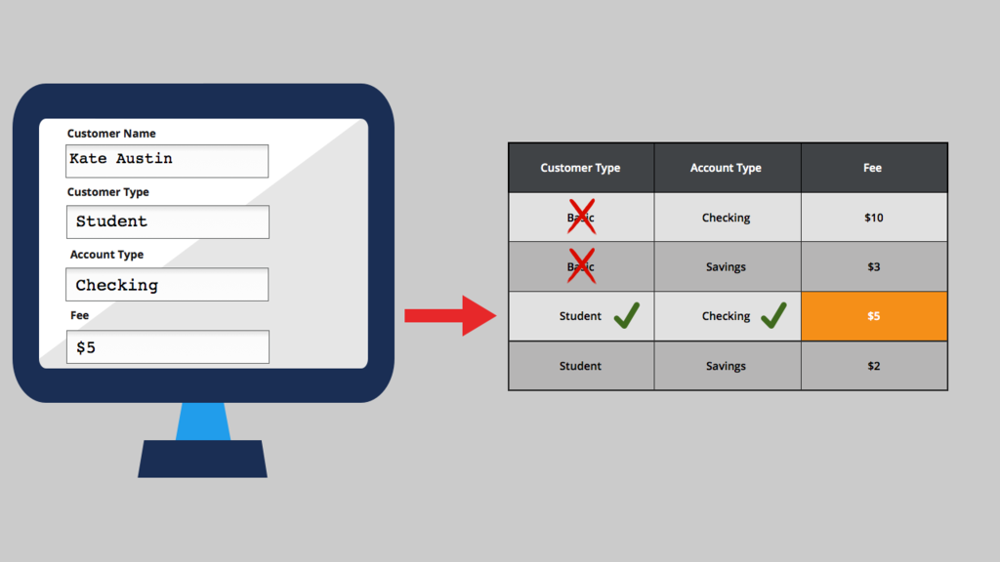

# Calculating fields using decision tables

- [Calculating fields using decision tables](#calculating-fields-using-decision-tables)
    - [1. Decision tables](#1-decision-tables)
        - [1.1. Decision table logic](#11-decision-table-logic)
        - [1.2. Decision tables in App Studio](#12-decision-tables-in-app-studio)

## 1. Decision tables

A decision table consists of a table of conditions and results.

- You define a set of conditions and the results to return when the conditions are true.
- Each set of conditions contains a corresponding result.
- You can add columns for each condition you want to test against and rows for each combination of conditions you want to test.
- When the system evaluates a decision table, it starts with the top row and evaluates each condition in the row. 
    - If all of the conditions are true, the system returns the result for that row. 
    - If not, it advances to the next row, and evaluates the conditions in that row. 
    - And if none of the combinations returns a result, the system returns the otherwise result at the bottom of the table. This ensures that the decision always returns a result.

### 1.1. Decision table logic

Decision tables are a good approach when you use a set of properties or expressions to arrive at a decision.

> Example of decision table logic:
>
> 

- By default, a condition uses an equal comparison operator.
- If you are using numeric conditions, you can also specify greater than or less than comparison operators.

### 1.2. Decision tables in App Studio

You can configure calculated fields using out-of-the-box basic functions and simple custom expressions in App Studio. 

- For complex calculations which involve multiple conditions with varying results based on the conditions, you can configure a calculated field that references an existing or custom decision table.

---

    <a href="[2.16] Designing a mobile app experience.md">⬅️PREVIOUS</a>
    |
    <a href="[2.18] Inviting users to an application.md"> NEXT➡️</a>

