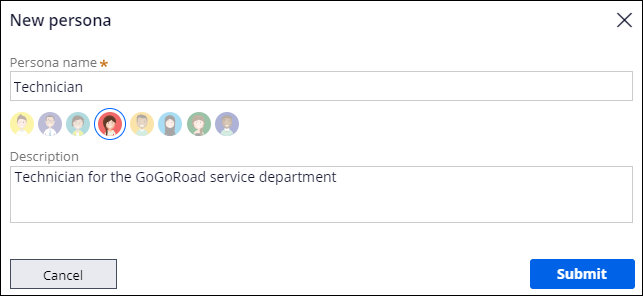
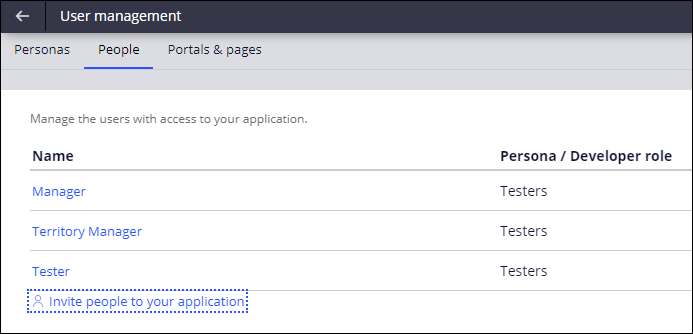

# Inviting users to an application

- [Inviting users to an application](#inviting-users-to-an-application)
    - [1. Users and personas](#1-users-and-personas)
        - [1.1. Personas and channel interfaces](#11-personas-and-channel-interfaces)
            - [1.1.1. Personas](#111-personas)
            - [1.1.2. Channel interfaces](#112-channel-interfaces)
        - [1.2. User management](#12-user-management)

## 1. Users and personas

Applications have users, though not all users perform the same tasks.

- PEGA provides a **User Management** feature to help you organize the users of your application into **personas** that share common application security and assignments. 

### 1.1. Personas and channel interfaces

When you create an application, Pega Platform provides one default persona called **Users**. Users are case participants that are responsible for creating and resolving cases.

- Create additional personas when a unique combination of channel interface, responsibilities, permissions, and work routing requires differentiation from an existing persona.
    - When you create a new persona, Pega Platform creates default permissions and a work queue for the persona.
    - You can modify the permissions and work queue and create and customize a dedicated channel interface.
- Associate a persona to the channel interfaces that best satisfy the needs of the persona.
    - Multiple personas can share a channel interface if appropriate.

#### 1.1.1. Personas

A **persona** is the business representation of a type of user.

- Personas allow the organization to identify unique needs for application users, which could include different user interfaces to meet those needs.
- In **App Studio**, you can add a new persona by clicking **Users > User Management** and adding a persona in the **Persona** tab
- Once the new persona is created, you can then assign it to users, as well as further configure the application to meet the persona's needs.

#### 1.1.2. Channel interfaces

In PEGA, user interfaces are also called **channel interfaces**.

- Because the needs of different users require access to different application features, you can configure different personas and channel interfaces. 

### 1.2. User management

A **user** is an individual who interacts with an application.

- In App Studio, create a new user with an email address and assign them a persona or developer role by clicking **Users > User management > People**.

---

  <a href="[2.17] Calculating fields using decision tables">⬅️PREVIOUS</a>

