# Managing application development

- [Managing application development](#managing-application-development)
    - [1. Agile workbench](#1-agile-workbench)
        - [1.1. Work items](#11-work-items)
        - [1.2. Application profile](#12-application-profile)
            - [1.2.1. Features and subfeatures](#121-features-and-subfeatures)
            - [1.2.2. Status](#122-status)
        - [1.3. Agile workbench navigation](#13-agile-workbench-navigation)
            - [1.3.1. Create a story, bug, or feedback item](#131-create-a-story-bug-or-feedback-item)
            - [1.3.2. View the menu](#132-view-the-menu)
            - [1.3.3. View stories, bugs, and feedback](#133-view-stories-bugs-and-feedback)
            - [1.3.4. List existing stories, bugs, or feedback items by feature](#134-list-existing-stories-bugs-or-feedback-items-by-feature)
            - [1.3.5. Filter existing stories, bugs, or feedback items](#135-filter-existing-stories-bugs-or-feedback-items)
            - [1.3.6. Sort existing stories, bugs, or feedback items](#136-sort-existing-stories-bugs-or-feedback-items)
            - [1.3.7. Find an existing story, bug, or feedback item](#137-find-an-existing-story-bug-or-feedback-item)
            - [1.3.8. Change work item status](#138-change-work-item-status)
            - [1.3.9. Use record and screen capture to create a work item](#139-use-record-and-screen-capture-to-create-a-work-item)
            - [1.3.10. Create a new feature](#1310-create-a-new-feature)
        - [1.4. Agile workbench use case](#14-agile-workbench-use-case)
        - [1.5. Agile workbench integration](#15-agile-workbench-integration)
    - [2. Release management with PEGA](#2-release-management-with-pega)
        - [2.1. DevOps](#21-devops)
        - [2.2. Continuous integration and delivery](#22-continuous-integration-and-delivery)
            - [2.2.1. Continuous integration](#221-continuous-integration)
            - [2.2.2. Continuous delivery](#222-continuous-delivery)
        - [2.3. The PEGA CI/CD pipeline](#23-the-pega-cicd-pipeline)
        - [2.4. DevOps Technology](#24-devops-technology)
            - [2.4.1. The Deployment Manager](#241-the-deployment-manager)
            - [2.4.2. Third-party tools](#242-third-party-tools)
    - [3. Agile development best practices](#3-agile-development-best-practices)

## 1. Agile workbench

- A tool used in a PEGA project for stakeholders and team members to track feature development and capture real-time project feedback. 
- supports <abbr title="Direct Capturing Objectives">DCO</abbr> and agile development.

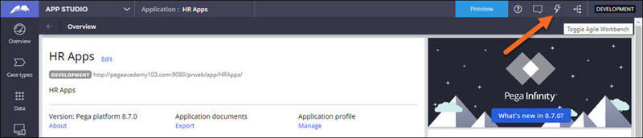

### 1.1. Work items

Three kinds of work items:

| Type         | Description                                                        |
| ------------ | ------------------------------------------------------------------ |
| User stories | to describe business requirements                                  |
| Bugs         | to document feature defects                                        |
| Feedback     | to record enhancement requests identified during playback sessions |

### 1.2. Application profile

Provides an up-to-date view of the work items, features, and their status in your application.

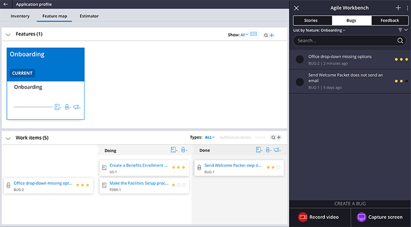

#### 1.2.1. Features and subfeatures

- You can associate work items with features or subfeatures
- When you create a new case type in your application, Pega Platform automatically creates a feature with the same name.

<dl>
    <dt>Features</dt>
    <dd>capabilities that you want your application to support</dd>
</dl>

<dl>
    <dt>Subfeatures</dt>
    <dd>features within a feature</dd>
</dl>

#### 1.2.2. Status

- Every work item has a status of `To do` `Doing` or `Done`
- You change the status of a work item by dragging the card to the appropriate column or using the Status list on the work item itself.

### 1.3. Agile workbench navigation

#### 1.3.1. Create a story, bug, or feedback item

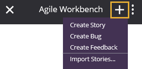

- Click the **Add** icon to create a new story, bug, or feedback item.
- you can create user stories by downloading the Excel template and importing the Excel file with the user story information.

#### 1.3.2. View the menu

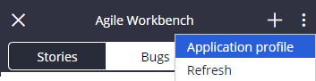

- Click the **More** icon to view the Application profile and refresh Agile Workbench.

#### 1.3.3. View stories, bugs, and feedback

- Click **Stories**, **Bugs**, or **Feedback** to view the user stories, bugs, and feedback items in your application.

#### 1.3.4. List existing stories, bugs, or feedback items by feature

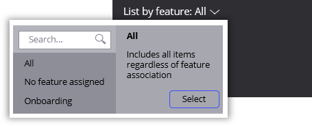

- Use the List by feature list to select a feature defined in your application.

#### 1.3.5. Filter existing stories, bugs, or feedback items

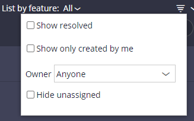

- Use the Filter work items icon to filter work items by owner.
- Filters:
    - resolved work items
    - items you created
    - items created by others
    - unassigned work items

#### 1.3.6. Sort existing stories, bugs, or feedback items

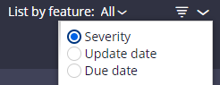

- Use the Sort work items icon to sort work items by:
    - priority **(default)**
    - update date
    - due date

#### 1.3.7. Find an existing story, bug, or feedback item

- Use the Search option to find an existing work item.

#### 1.3.8. Change work item status

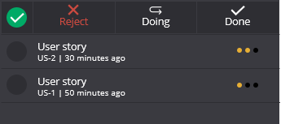

- Click the icon to the left of the work item to either:
    -  reject the item
    -  change its status to `Doing`
    -  change its status to `Done`

#### 1.3.9. Use record and screen capture to create a work item

- Use the **Record video** and **Capture screen** options to capture a video or image of the application, which is attached to a new work item.

#### 1.3.10. Create a new feature

- In the ***Application profile***, click the **Add** icon to create a new feature.

### 1.4. Agile workbench use case

In a typical scenario using Agile Workbench, you demonstrate or play back each feature of a case type with the business stakeholders and product owners.

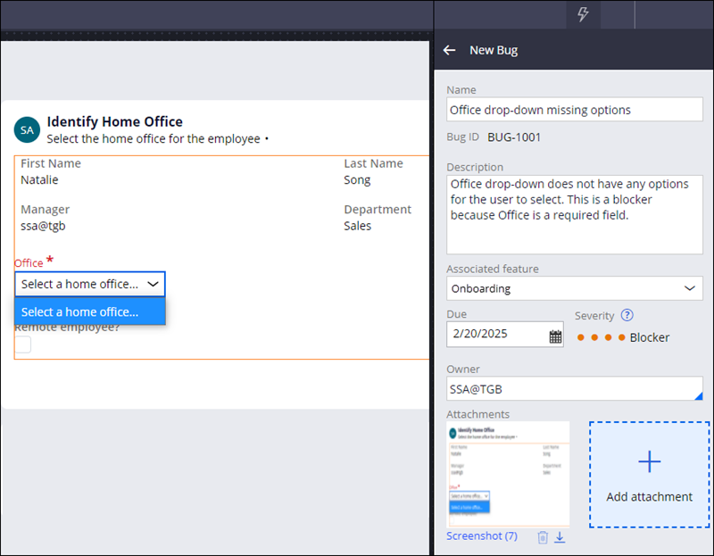

### 1.5. Agile workbench integration

Agile workbench interfaces with:

- **Agile Studio**, a separate Pega Platform tool that expands the Agile Workbench functionality with more robust features for release management, progress tracking, team capacity, and analytics.
- external tools such as Jira or CA Agile Central.

## 2. Release management with PEGA

- DevOps is a collaborative effort between development, quality, and operations staff to deliver high-quality software to end users in an automated, agile way.
- By continuously delivering new application features to end users, organizations can gain a competitive advantage in the market. 

### 2.1. DevOps

- a set of practices that bridge application development and operational behavior to reduce time to market without compromising on quality and operational effectiveness.

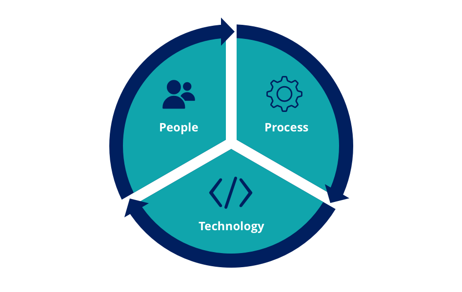

- DevOps methodology drives innovation and operates on three components:
    - <dl><dt>People</dt><dd>DevOps encourages a culture of collaboration between development, quality, and operations teams to reduce or eliminate barriers through fundamental practices such as continuous integration, continuous delivery, and continuous deployment.</dd></dl>
    - <dl><dt>Process</dt><dd>DevOps encourages an automated process to quickly move applications from development through testing to deployment.</dd></dl>
    - <dl><dt>Technology</dt><dd>DevOps encourages model-driven and open solutions to build a deployment pipeline.</dd></dl>

### 2.2. Continuous integration and delivery

A <abbr title="Conitnuous Integration">CI</abbr>/<abbr title="Continuous Delivery">CD</abbr> pipeline is an automated process to quickly move applications from development through testing to deployment.

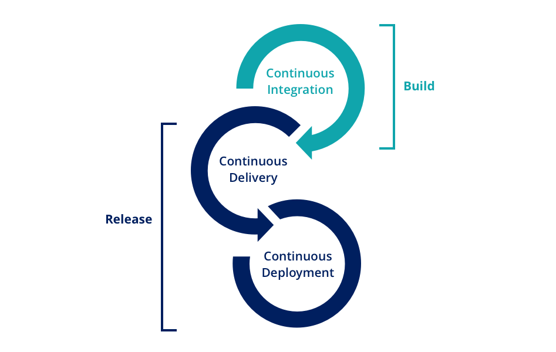

1. <dl><dt>Continuous Integration loop</dt><dd>the team continuously integrates changes to a shared repository every day during the build process.</dd></dl>
2. <dl><dt>Continuous Delivery loop</dt><dd>the team is always ready to ship during the release phase</dd></dl>
3. <dl><dt>Continuous Deployment loop</dt><dd>he team continuously deploys and ships the product during the release phase.</dd></dl>

#### 2.2.1. Continuous integration

- developers frequently check in changes to the source environment and use an automated build process to verify these changes automatically.
- You should add ***'ready to share'*** and ***'integrate changes'*** steps as part of your pipeline to ensure that all the necessary critical tests are run before integrating and publishing changes to a development repository.

#### 2.2.2. Continuous delivery

- application changes run through rigorous automated regression testing
- The changes are deployed to a staging environment for further testing to ensure that the application is ready to deploy on the production system.
- In a ***'ready to accept'*** step, testing runs to ensure that the acceptance criteria are met. 
- A ***'ready to deploy'*** step verifies all the necessary performance, scale, and compatibility tests that are necessary to ensure that the application is ready for deployment.
- The deploy step validates in a preproduction environment, deploys to production, and runs post-deployment tests with the potential to roll back as needed.

### 2.3. The PEGA CI/CD pipeline

> Di ko alam pano gagawan ng reviewer to: [module reference](https://academy.pega.com/topic/release-management-pega-platform/v2/in/29826/29951/30466#p-9a37c58c-6a71-4186-be3f-3852ef178236)

### 2.4. DevOps Technology

You can start your DevOps journey by using the **Deployment Manager** and integrate third-party tools at a later time.

#### 2.4.1. The Deployment Manager

- Pega offers a pipeline manager, called the **Deployment Manager**.
- configure and run continuous integration and delivery (CI/CD) workflows for your PEGA applications from within PEGA.
- you can fully automate your CI/CD workflows, including branch merging, application package generation, artifact management, and package promotion to different stages in the workflow.
- You must properly configure and integrate Deployment Manager with App Studio before you can publish changes.
    - When the Deployment Manager is integrated on the App Studio environment, the pipeline for a specific application is exposed through App Studio `(Settings > Versions)`
- Applications designers can publish their changes to higher environments, which eliminates the need for system administrators to promote or configure applications manually.
- You can access the Deployment Manager in Admin Studio.

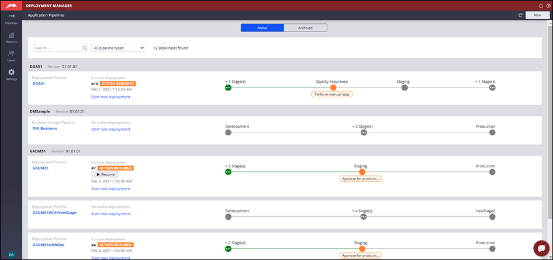

#### 2.4.2. Third-party tools

- PEGA includes support for open DevOps integration using popular third-party tools such as Jenkins and Microsoft Azure DevOps by providing an open platform with all the necessary hooks and services

## 3. Agile development best practices

> Di ko alam pano gagawan ng reviewer to: [module reference](https://academy.pega.com/topic/agile-development-best-practices/v3/in/29826/29951/30466#p-32d36e3d-e0f6-4329-9688-c1e197c8c1a8)

---

    <a href="[2.2] Sizing a PEGA Platform project.md">NEXT ➡️</a>

