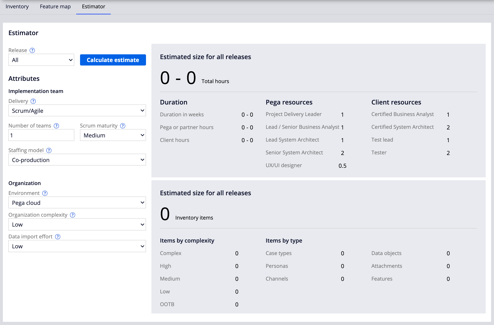

Sizing a PEGA project

- [1. Roles on a PEGA project](#1-roles-on-a-pega-project)
    - [1.1. Project teams](#11-project-teams)
    - [1.2. Overlap of role tasks](#12-overlap-of-role-tasks)
- [2. The estimator tool](#2-the-estimator-tool)

## 1. Roles on a PEGA project

### 1.1. Project teams

- <dl><dt>Consulting solutions executive</dt>
    <dd>Provides thought leadership, oversees project delivery and direction, establishes best practices and governance.</dd></dl>
- <dl><dt>Project delivery leader</dt>
    <dd>Provides overall project plan and delivery guidance.</dd></dl>
- <dl><dt>Product owner</dt>
    <dd>Owns the product backlog and prioritization of backlog items. Creates acceptance criteria.</dd></dl>
- <dl><dt>Scrum master</dt>
    <dd>Promotes and supports Scrum and ensures that all team members understand Scrum theory and practices. Facilitates Scrum events as needed.</dd></dl>
- <dl><dt>System architect</dt>
    <dd>Designs and configures the application. Lead or principal architects (LSA) design the overall architecture. Senior (SSA) and system architects (SA) configure assets such as user interface forms and automated decisions. They contribute object-oriented design and technical implementation skills.</dd></dl>
- <dl><dt>Business architect</dt>
    <dd>Works with subject matter experts and stakeholders to understand business needs. In a Pega Platform™ application, Business Architects define business rules, service level agreements, and processes</dd></dl>
- <dl><dt>Subject matter expert</dt>
    <dd>Has deep understanding of a particular business topic or domain. The SME works with the project team to convey business needs and helps validate information accuracy.</dd></dl>
- <dl><dt>Quality assurance</dt>
    <dd>Creates and executes functional and performance test scripts, participates as part of the Scrum team.</dd></dl>
- <dl><dt>Specialty architects</dt>
    <dd>Engage with project development depending on project needs and skills alignment. For example, a UX Architect may be needed to design complex user views and a Deployment Architect may be needed to handle application deployment.</dd></dl>
- <dl><dt>System administrator and IT resources</dt>
    <dd>Provide expertise as needed. For example, on infrastructure, security, or integration.</dd></dl>
- <dl><dt>Citizen developers</dt>
    <dd>Citizen developers are non-technical business users who participate in low-code application development in App Studio. These developers bring valuable knowledge about business needs and may perform the role of SME on a small Pega project.
      
    Citizen developers work on small-scale applications that are less widely used than enterprise applications. For example, a citizen developer creates a system to record feedback and assign tasks to their team.</dd></dl>

### 1.2. Overlap of role tasks

The tasks and responsibilities for each role may overlap or are accomplished by multiple roles. For example, on a small project, a Lead System Architect may also perform the duties of the Deployment Architect.

## 2. The estimator tool

In App Studio, you can provide information about your planned application, such as:

- implementation methodology
- number and complexity of features that you want implement
- how many scrums teams are involved

**Estimator tool**

- automatically calculates the predicted project duration
- use the estimator tool to specify details about your organization and implementation team
- return results in weeks and hours so that you can conveniently plan the work
- you can prepare estimations for a selected release or all release to get a holistic view of your project development

 

> 
> 
> 1. <dl><dt>Release</dt>
>     <dd>Select a specific release (<strong>MLP1</strong>, <strong>MLP2</strong>, <strong>MLPn</strong>, <strong>Future</strong>, <strong>Unplanned</strong>, <strong>All</strong>, or custom) to view the estimate for that release.</dd></dl>
> 2. <dl><dt>Delivery</dt>
>     <dd>Select the implementation method that your development team uses: <strong>Scrum/Agile</strong> or <strong>Waterfall/Other</strong>.</dd></dl>
> 3. <dl><dt>Number of teams</dt>
>     <dd>Enter the number of scrum teams that are working on the project. You can reduce the development duration with more teams.</dd></dl>
> 4. <dl><dt>Scrum maturity</dt>
>     <dd>For Scrum/Agile projects, you rate the team members' familiarity with Scrum.</dd>
>     <dd><strong>Medium</strong> maturity increases the estimated effort and duration by 7.5%, while <strong>Low</strong> maturity increases the estimated effort and duration by 15%.</dd></dl>
> 5. <dl><dt>Staffing model</dt>
>     <dd>Select a staffing model that indicates the level of cooperation between the client and Pega. If you use Pega's co-production model, the consultants provided by Pega or a Pega partner are supplemented with resources from the client.</dd>
>     <dd>Co-production immerses client resources in Pega application development during the learning process, helping clients become proficient at building Pega applications more quickly.</dd></dl>
> 6. <dl><dt>Environment</dt>
>     <dd>Select the environment in which you want to deploy the application.</dd>
>     <dd>A new on-premise environment increases the estimated effort and duration by 10%.</dd></dl>
> 7. <dl><dt>Organization complexity</dt>
>     <dd>Select an option that indicates how many levels and regulations your organization has.</dd>
>     <dd>Organizations with high complexity typically must comply with external regulations and additional validation requirements.</dd></dl>
> 8. <dl><dt>Data import effort</dt>
>     <dd>Select the required effort to migrate data from a legacy system to a new Pega system.</dd>
>     <dd><ul>
>     <li><strong>None</strong></li>
>     <li><strong>Low</strong> increases the estimated effort and duration by 10%.</li>
>     <li><strong>Medium</strong> increases the estimated effort and duration by 20%</li>
>     <li><strong>High</strong> increases the estimated effort and duration by 30%</li>
>     </ul></dd></dl>
> 9. <dl><dt>Inventory assets</dt>
>     <dd>The system uses inventory assets to create application development estimates. The inventory includes personas, channels, features, data from all the case types in your application, and the relationships between these assets.</dd>
>     <dd>The case type, data object, persona, and channel information that is used by the estimator comes from the workflow of the case life cycle. The features come from the Application profile Feature map. Items marked as complete are not included as part of the estimated effort.</dd></dl>

 

After you estimate your work, you can share the calculations outside of PEGA by exporting the results to an Excel file.

To use the Estimator, you first need to define the main elements of your application: 

- Create a case type, and then define the case life cycle by adding stages, processes, and steps.
- Define personas that represent users of your application.
- Create data objects that visualize the information that your cases require to reach the resolution stage.
- Add features that represent usable functionalities in your application.
- You then assign the channels and data objects to a release to establish a rough estimate of the work planned for each release.

    > By default, PEGA provides four default releases: **MLP 1**, **MLP 2**, **MLP n**, and **Future**. The Application Profile also provides an **Unplanned** release option, which incorporates elements that do not have a release explicitly defined.
