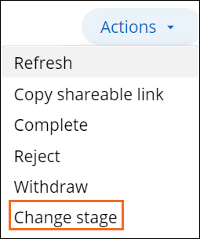
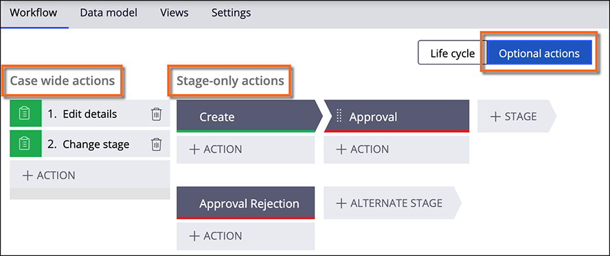

# Adding optional actions to a workflow

- [Adding optional actions to a workflow](#adding-optional-actions-to-a-workflow)
    - [1. Optional actions](#1-optional-actions)
    - [2. Case-wide and stage-only actions](#2-case-wide-and-stage-only-actions)

## 1. Optional actions

You can define actions that users optionally perform during case processing. These actions are called **optional actions**.

Optional actions may also be common case processing actions that may be invoked at varying times during the case. For example, PEGA provides an optional **Change Stage** action that may be called at any time during case processing.

Depending on the business need, the optional action can be:

- a process if a series of steps are required
- or a user action if exactly one step is required.

Optional actions are accessible at runtime from the **Actions** menu in the case.

## 2. Case-wide and stage-only actions

You can add optional actions as **case-wide** or **stage-only** actions. If your action or process is only relevant in the context of a specific stage, configure the work as a stage-only action. PEGA provides some built-in case wide actions like **Change Stage** and **Transfer Assignment**.

---

    <a href="[2.2] Sizing a PEGA Platform proejct.md">⬅️PREVIOUS</a>
    |
    <a href="[2.4] Automating workflow decisions.md"> NEXT➡️</a>

