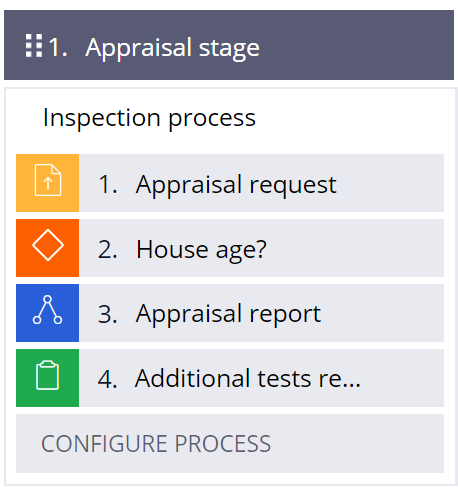
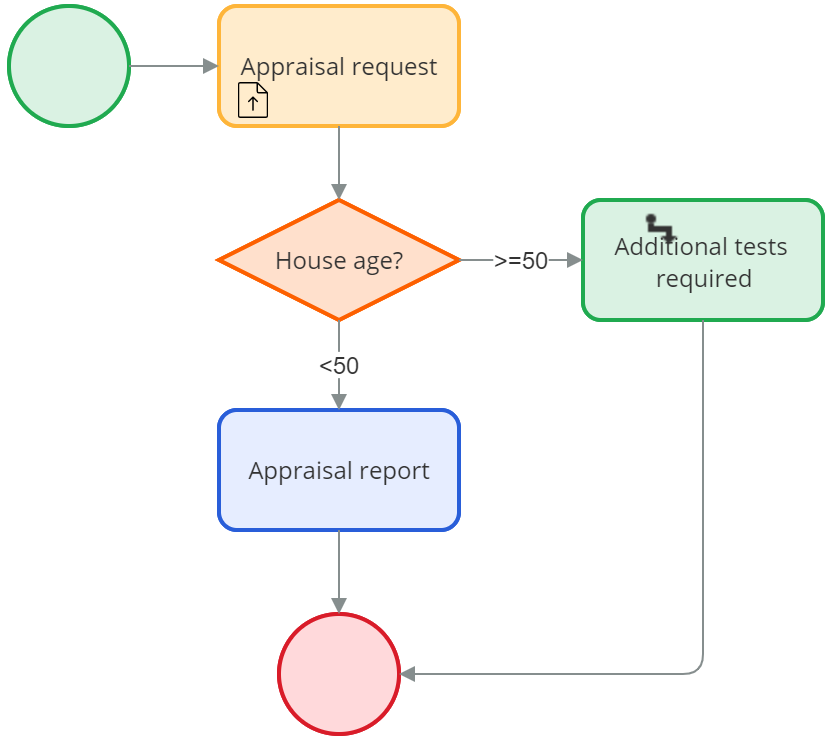

# Automating workflow decisions

- [Automating workflow decisions](#automating-workflow-decisions)
    - [1. Decision points](#1-decision-points)
        - [1.1. Automated decisions](#11-automated-decisions)
        - [1.2. Decision shapes](#12-decision-shapes)

## 1. Decision points

### 1.1. Automated decisions

- Automating decisions allows application users to focus on decisions that require human expertise. 
- In PEGA you can model complex case life cycles that require branching or skipping a step. 
- In a PEGA application, a flow is a sequence of events that models a business process.
- You can define paths in a flow by using graphical shapes and connectors.
- The shapes and settings that you choose depend on the types of decisions that users make, and the order in which the events occur.

> **Case life cycle view**
> 
> 
> 
> **Process flow view**
> 
> 

### 1.2. Decision shapes

- You can use a Decision shape to add a conditional path to a flow or model more complex use cases. 
- By defining the events that cause your flow to follow different paths, you can create cases that support more than one outcome.
- Decision shapes are configured to advance a workflow automatically.
- An automated decision evaluates business logic or a set of one or more conditions. 
