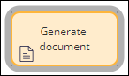
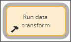

# Automation shapes in the case life cycle

- [Automation shapes in the case life cycle](#automation-shapes-in-the-case-life-cycle)
    - [1. Automation shapes](#1-automation-shapes)
        - [1.1. Automation shapes](#11-automation-shapes)

## 1. Automation shapes

Certain steps, such as collecting identifying information from a customer, require user action, while other steps can be performed automatically by the system, such as sending a confirmation email to a customer.

Automations provide flexibility because each automation has unique parameters that you can configure based on your business requirements. Additionally, utilizing automations reduces possible human error by reducing the amount of human interaction.

> Note: In the case life cycle, click **Step** > **More** > **Automations** to add an automation. In the process modeler, click **Add** > **Automations** to add an automation.

### 1.1. Automation shapes

The following table describes all automation shapes available in App Studio.

| Shape name            | Image                                            | Description                                                                                          |
| --------------------- | ------------------------------------------------ | ---------------------------------------------------------------------------------------------------- |
| Attach content        |        | Attaches a file, URL, or note to a case                                                              |
| Change to a stage     |       | Change to a specific stage of a case                                                                 |
| Change to next stage  |  | Change to the next stage of a case                                                                   |
| Create case           |           | Creates one or more cases from the current case                                                      |
| Create PDF            |            | Creates a PDF file from a specified section and attaches it to the case                              |
| Generate document     |     | Generates a document from a Word template and attaches it to the case                                |
| Persist case          |          | Converts a temporary case to a permanent object in the database                                      |
| Post to pulse         |         | Creates a message and sends it to the Pulse social stream                                            |
| Push to notification  |     | Sends a notification to an iOS or Android mobile device to indicate that a case requires user action |
| Run a data transform  |    | Runs a data transform                                                                                |
| Send email            |            | Send formatted emails to custom recipients                                                           |
| Send notification     |     | Sends a notification to recipients over multiple channels                                            |
| Update a case         |           | Updates the current case or all child cases and descendants                                          |
| Search duplicate case |      | Searches for duplicate cases using set conditions                                                    |
| Wait                  |                  | Pauses a case until a specified condition is fulfilled, such as timer or case status                 |
| Questionnaire         |         | Asks the user to complete a questionnaire                                                            |

---

    <a href="[2.4] Automating workflow decisions.md">⬅️PREVIOUS</a>
    |
    <a href="[2.6] Creating child case.md"> NEXT➡️</a>

