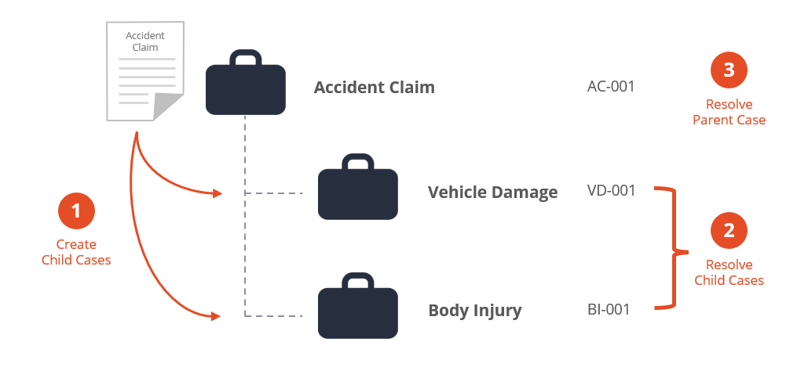
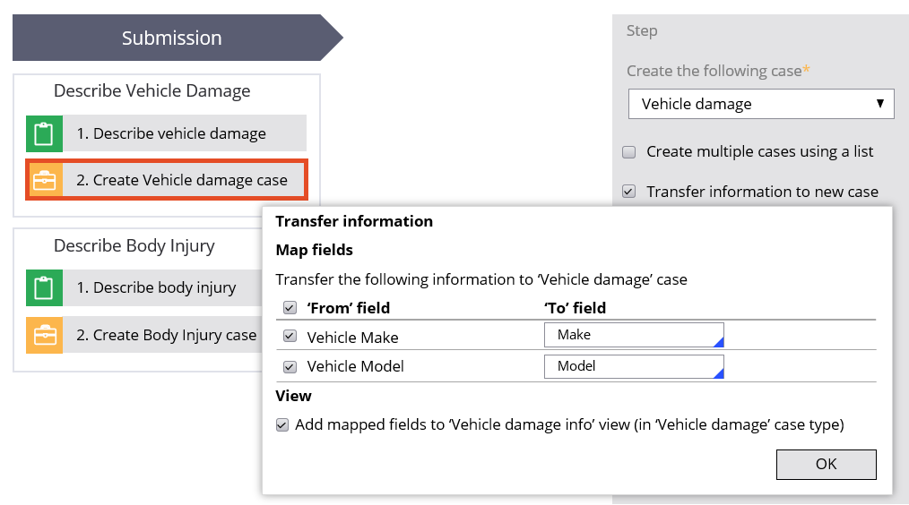

# Creating a child case

- [Creating a child case](#creating-a-child-case)
    - [1. Child cases](#1-child-cases)
        - [1.1. Case hierarchy](#11-case-hierarchy)
        - [1.2. Create case step](#12-create-case-step)
            - [1.2.1. Data Propagation](#121-data-propagation)

## 1. Child cases

### 1.1. Case hierarchy

Complex business transactions require the creation of multiple cases. In PEGA you can model case relationships with a case hierarchy that contains **top-level cases** and **child cases**.

> 
> The *Accident Claim* case is a **top-level case**, which is a case that does not have a parent case but can become a parent of other cases. *Vehicle Damage* and *Body Injury* are **child cases**, which represent work that must be completed to resolve the parent.
>
> Implementing a business process in a separate case type also allows you to reuse the case type as needed. For example, claims for both automobile and property insurance may involve a body injury claim. By implementing body injury claims as a separate case type, you can use the body injury case type with both automobile and property claims.

### 1.2. Create case step

- To add a child case to a case type, add a **Create Case*8 automation step to the case life cycle.
- When encountering the Create Case step, Pega Platform creates an instance of the specified case type.

> ***Dev Studio*** gives you additional configuration options for the Create Case step. The created case can either be a top-level case or child case. Additionally, multiple child cases can be created. 

#### 1.2.1. Data Propagation

- When creating a child case, you can also specify the information to copy from the parent case to the child case through a process known as propagation
- This configuration is performed on the Create Case step.

- If the data in the child case should represent the data at the time of the child case creation, data propagation is appropriate.
- If the information should remain synchronized with the parent case, and the data may change on the parent case, then it is more appropriate to reference the data in the parent case.