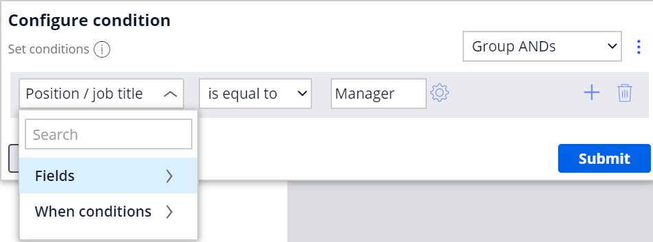
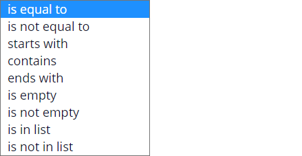
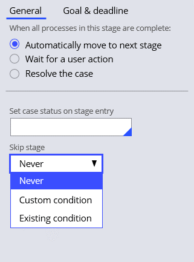
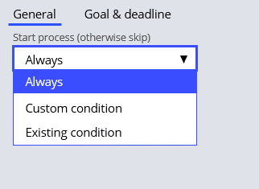

# Skipping a process or a stage

- [Skipping a process or a stage](#skipping-a-process-or-a-stage)
    - [1. Conditional execution of processes and stages](#1-conditional-execution-of-processes-and-stages)
        - [1.1. Conditional execution](#11-conditional-execution)
        - [1.2. Skipping a process or stage](#12-skipping-a-process-or-stage)
            - [1.2.1. Skipping a stage](#121-skipping-a-stage)
            - [1.2.2. Skipping a process](#122-skipping-a-process)
        - [1.3. Building conditions](#13-building-conditions)

## 1. Conditional execution of processes and stages

### 1.1. Conditional execution

- In PEGA you can define conditions that control whether a process or stage runs in a case. 
- A **condition** consists of a field, comparator, and value.
- Processes and stages are either executed or skipped if the case run-time values match the conditional logic defined.

**Configure condition screen**

1. <dl><dt>Field or When condition</dt>
    <dd>Select a field or when condition. You can configure existing fields or conditions to form a simple or advanced logic string.</dd></dl>
2. <dl><dt>Comparator</dt>
    <dd>Select a comparator from the list.</dd>
    <dd></dd></dl>
3. <dl><dt>Value</dt>
    <dd>Enter or select another field or existing values.</dd>
    <dd></dd></dl>

### 1.2. Skipping a process or stage

#### 1.2.1. Skipping a stage

In the case life cycle, select the stage of interest to configure a condition to skip a stage.

> By default, a stage never skips unless a condition is present.

#### 1.2.2. Skipping a process

In the case life cycle, select the process of interest to configure a condition to start a process.

> By default, a process always starts unless a condition is present.

### 1.3. Building conditions

You can add more than one condition to a stage or process. 
