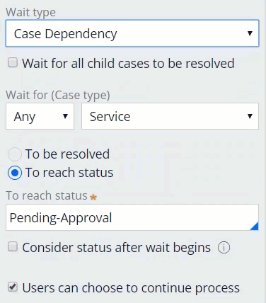

# Pausing and resuming case processing

- [Pausing and resuming case processing](#pausing-and-resuming-case-processing)
    - [1. Case workflow dependency](#1-case-workflow-dependency)
        - [1.1. Wait types](#11-wait-types)
            - [1.1.1. Case dependency](#111-case-dependency)
            - [1.1.2. Timer](#112-timer)
        - [1.2. Wait step versus user action](#12-wait-step-versus-user-action)

## 1. Case workflow dependency

- You can enforce dependencies using the Wait step.
- The Wait step allows you to pause and resume case processing when the case meets conditions that you define.

### 1.1. Wait types

The Wait step can be configured to pause case processing based on Wait type: 

- **Case Dependency**
- **Timer**

#### 1.1.1. Case dependency

The Case Dependency wait type pauses case processing of a parent case until the child case dependency resolves.

- You create a case dependency by adding a **Wait** step to the parent case
- When a parent case reaches the **Wait** step, the case pauses until all child cases or any child case of a given type reach a defined status.
- The status could be a standard status like `Pending-Approval` or a custom status defined in your application.
- You can also set the **Wait** step to **To be resolved**, where a case is resolved when the case status is set to a value that starts with the word `Resolved`.
- You can set the case to consider only the current status or status changes after the case reaches the Wait shape
- You can also allow users to cancel the wait conditions and continue processing a case.

#### 1.1.2. Timer

The Timer wait type pauses a case until the **Set date/time interval** expires or until a **Reference date/time** is reached.

- You can configure the Wait step to pause the process for a fixed interval (hours/minutes) or based on the value of a property reference.
- You either specify a specific length of time the case should pause, or use a variable that contains a date when the case should resume.
- You want to pause the case until the wait time has elapsed

### 1.2. Wait step versus user action

It is important to recognize the distinction between **deliberately pausing a case by inserting a Wait step**, and **delays in case processing that occur while awaiting user action** on assignment steps that must be completed before a case can proceed. 
