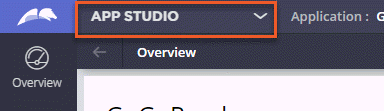
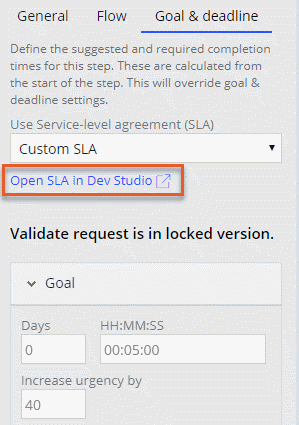

# Dev Studio overview

- [Dev Studio overview](#dev-studio-overview)
    - [1. Dev Studio](#1-dev-studio)
        - [1.1. Dev Studio](#11-dev-studio)
        - [1.2. Co-develop solutions](#12-co-develop-solutions)
        - [1.3. Promote reuse throughout the organization](#13-promote-reuse-throughout-the-organization)
        - [1.4. Switch between studios as needed](#14-switch-between-studios-as-needed)
            - [1.4.1. Naming difference between studios](#141-naming-difference-between-studios)

## 1. Dev Studio

### 1.1. Dev Studio

Robust, enterprise-grade Pega Platform™ applications depend on cooperation between two key groups of application developers. 

- **Domain experts**
    - business analysts, citizen developers, and front-end developers
    - provide valuable insight into processes and user needs.
- **Implementation experts**
    - system architects, full-stack developers, database administrators, and security administrators
    - provide the expertise needed to address critical use cases that require complex configurations.

To support advanced rule configuration in applications, Pega Platform provides implementation experts with a second development environment, **Dev Studio**.

- In Dev Studio, implementation experts access rule forms directly to address complex or less-common configuration requirements.
- Dev Studio provides features for configuring security permissions and access control, managing rules to promote reuse, and addressing the performance limitations of an application.

### 1.2. Co-develop solutions

**Business analysts** and **citizen developers** understand business needs. **System architects** understand the capabilities of Pega Platform.

- To help these two groups work together, Pega Platform enables a co-development approach that embraces the strengths of each group.
-  By working together, domain experts and implementation experts can create better solutions more quickly.

### 1.3. Promote reuse throughout the organization

- In **App Studio**, developers configure rules such as processes, views, correspondence, and service levels for a single case type.
- In **Dev Studio**, developers access all the layers of an application and can extend the rule scope from a single case type to an application, division, or even the entire organization to create a library of standardized, reusable rules. 

### 1.4. Switch between studios as needed

Application developers can switch between App Studio and Dev Studio as needed to configure rule behavior.

In addition, from App Studio, you can open specific rules in Dev Studio.

#### 1.4.1. Naming difference between studios

| App Studio        | Dev Studio                    |
| ----------------- | ----------------------------- |
| Field             | Property                      |
| Goal and deadline | Service Level Agreement (SLA) |
| User              | Operator                      |
| Team              | Workgroup                     |

---

    <a href="[3.2] Creating a rule.md">NEXT ➡️</a>

