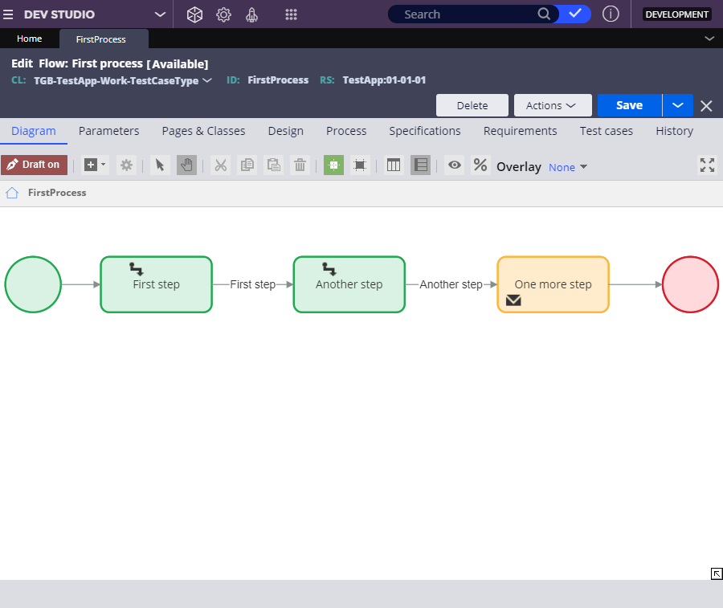

Creating a rule

- [1. Rules and rule types](#1-rules-and-rule-types)
    - [1.1. Automated rule creation in App Studio](#11-automated-rule-creation-in-app-studio)
    - [1.2. Application modularity with rules](#12-application-modularity-with-rules)
- [2. Rulesets](#2-rulesets)
    - [2.1. Ruleset versioning](#21-ruleset-versioning)
    - [2.2. Ruleset stack](#22-ruleset-stack)
    - [2.3. Ruleset best practices](#23-ruleset-best-practices)
        - [2.3.1. Naming conventions](#231-naming-conventions)
        - [2.3.2. Saving rulesets](#232-saving-rulesets)
        - [2.3.3. Versioning rulesets](#233-versioning-rulesets)
- [3. Rule creation](#3-rule-creation)
    - [3.1. Automated rule creation](#31-automated-rule-creation)
    - [3.2. Rule creation in Dev Studio](#32-rule-creation-in-dev-studio)
        - [3.2.1. Instance key](#321-instance-key)
    - [3.3. Rule creation methods](#33-rule-creation-methods)
- [4. Rule reuse through inheritance](#4-rule-reuse-through-inheritance)
    - [4.1. Inheritance methods](#41-inheritance-methods)
    - [4.2. Pattern inheritance](#42-pattern-inheritance)
    - [4.3. Directed inheritance](#43-directed-inheritance)
    - [4.4. Inheritance and rule reuse](#44-inheritance-and-rule-reuse)
- [5. Classes and class hierarchy](#5-classes-and-class-hierarchy)
    - [5.1. Classes](#51-classes)
    - [5.2. Parent and child classes](#52-parent-and-child-classes)
    - [5.3. Class hierarchy](#53-class-hierarchy)

## 1. Rules and rule types

A **rule** is the basic building block of a PEGA application that defines its behavior.

- Each rule is an instance of a rule type.
- The rule type determines the type of behavior modeled by the rule. 
- Rules describe the behavior for individual cases, such as how the user interface is displayed and when work urgency increases.
- PEGA uses the rules you create to generate application code in the background.

### 1.1. Automated rule creation in App Studio

- Much of the work of designing an application can be completed by using App Studio.
- PEGA provides a simplified interface that automatically creates and manages the underlying rules while allowing developers to focus on business tasks.

> **Case life cycle with a process created in App studio**

 

> **Flow rule of the process created in the background (Dev Studio)**

### 1.2. Application modularity with rules

The use of individual rules makes your application modular. By describing case behavior with modular, task-focused rules, you can combine and reuse rules as needed.

This modularity provides three significant benefits: **versioning**, **delegation**, and **reuse**.

| Benefit    | Description                                                                                                                                                                                                           |
| ---------- | --------------------------------------------------------------------------------------------------------------------------------------------------------------------------------------------------------------------- |
| Versioning | Developers create a new version of a rule whenever case behavior needs to change. Pega Platform maintains a history of changes to a rule, allowing developers to review the change history and undo changes if needed |
| Delegation | Developers delegate rules to business users to allow business users to update case behavior as business conditions change                                                                                             |
| Reuse      | Developers reuse rules whenever an application needs to incorporate existing case behavior                                                                                                                            |

## 2. Rulesets

To package rules for distribution as part of an application, you collect rules into a group called a **ruleset**. 

- A ruleset identifies, stores, and manages the set of rules that define an application or a significant portion of an application.

### 2.1. Ruleset versioning

Developers collect individual rules into an instance of a ruleset, called a **ruleset version**.

- To update the contents of the ruleset, you create a new ruleset version.
- The new ruleset version is available (**unlocked**) for the developer to make rule updates and add new rules.

**Version number**

- The version number is divided into three segments: a **major version**, a **minor version**, and a **patch version**.
- Each segment is a two-digit number starting at `01` and increasing to `99`.
- Ruleset version numbering starts at `01-01-01` and increments upward.

<dl><dt>Major version</dt>
<dd>represents a substantial release of an application. A major version change encompasses extensive changes to application functionality.</dd></dl>

<dl><dt>Minor version</dt>
<dd>represents an interim release or enhancements to a major release.</dd></dl>

<dl><dt>Patch version</dt>
<dd>consists of fixes to address bugs in an application.</dd></dl>

### 2.2. Ruleset stack

Each application consists of a sequence of rulesets called a **ruleset stack**.

- The ruleset stack determines the order in which Pega Platform looks through rulesets to find the rule that is in use.
- Each entry in the ruleset stack represents all the versions of the specified ruleset, starting with the listed version and working down to the lowest minor and patch version for the specified major version.
- Each version of an application contains a unique ruleset stack.
- The ruleset stack allows an updated application to reference new ruleset versions that contain updates and new features.

### 2.3. Ruleset best practices

#### 2.3.1. Naming conventions

- For application rulesets, use unique names that are meaningful in a business context and easy to remember to clearly convey the purpose of the ruleset.
- For organization, division, and shared rulesets, begin your ruleset name with a phrase that clearly identifies your company and the business purpose, and avoid using acronyms that might be difficult to decode.
- Do not use `Pega` or `Pega-` as a prefix for your ruleset names.
    - These prefixes are restricted to internal use in PEGA and can cause unexpected behavior.
- Avoid using **spaces** in ruleset names. The maximum length of a ruleset name is **32 characters**.
- Avoid the use of special characters such as dashes (`-`), underscores (`_`), plus signs (`+`), or quotes (`" "`).
    - The system does not permit the saving of rules with these attributes.

#### 2.3.2. Saving rulesets

- Avoid having the same ruleset in multiple applications. Instead, refactor the ruleset to its own application or a common application.
- Limit development to rulesets in the top-most application layer and keep built-on applications locked.

#### 2.3.3. Versioning rulesets

- Consider creating a major version of your application if you update your application server or database server to a major new version.
- Increment ruleset versions frequently to easily track updates to your application over time.
- Create a new ruleset with a top-level class that inherits directly from `@baseclass`.

## 3. Rule creation

### 3.1. Automated rule creation

In App Studio, rules are created automatically in the predefined application rules layer when you use the Case Designer. 

- It is a best practice to work in App Studio so that the rule creation process includes preset defaults
- By building your application in App Studio, you minimize issues and errors that are related to rule creation.

**Example of automatic rule creation**:
 
| App Studio                                                               | Dev Studio                                                                                                                                                                                                                                                                                                                                                                                                   |
| ------------------------------------------------------------------------ | ------------------------------------------------------------------------------------------------------------------------------------------------------------------------------------------------------------------------------------------------------------------------------------------------------------------------------------------------------------------------------------------------------------ |
| When you add a new case type in App Studio ...                           | It creates underlying rules available from both App Studio and Dev Studio, such as a case type rule and data pages. For example, adding an Employee relocation case type extends the `TGB-HRApps-Work` class to create a new work class, `TGB-HRApps-Work-EmployeeRelocation`, with rules such as:  `D_EmployeeRelocation` data page rule `pyDefault` case type rule `NewLocation` property rule |
| When you add a Mobile channel to your application ...                    | It creates new rules in Dev Studio. For example, adding a Mobile HR channel to an existing HR application creates new user interface rules in the `Data-Portal` class:  `MobileHR`                                                                                                                                                                                                                     |
| When you add a new process in App Studio Case Manager ...                | It creates a new flow rule in your Pega application. For example, adding a Pricing process in the Benefits enrollment case type creates a new flow rule applied to the `TGB-HRApps-Work-BenefitsEnrollment` class:  `Pricing_Flow`                                                                                                                                                                     |
| When you add a view in App Studio ...                                    | It creates a section rule in Dev Studio, and it sets the required class context for you.  For example, if you add the Employee performance view in App Studio, it adds a section rule in Dev Studio that applies to the `TGB-HRApps-Work_EmployeeEvaluation class`:  `RateEmployeePerformance`                                                                                                         |
| When you add a new data object using the Data explorer in App Studio ... | It creates data pages based on the type and source of the data object. For example, if you create a `Customer` data object, it will create three data page records in the `Data` class:  `D_Customer` `D_CustomerSavable` `D_CustomerList`                                                                                                                                                       |

### 3.2. Rule creation in Dev Studio

If you need more control over how a rule is created and reused, you can create rules in **Dev Studio**.

- Dev Studio uses the term records to refer to rules, properties, and other objects in PEGA

When you create a rule in Dev Studio, the **New Record** form prompts you to provide four pieces of information:

- **Rule type**: Specifies the function.
- **Ruleset**: Specifies the ruleset in which to organize the rule to improve the reusability of rules across your applications.
- **Apply to**: Specifies the class that the rule applies to.
- **Label**: Specifies the name that you want to use.

This combination allows an application to call the correct rule during case processing through a process called **rule resolution**. With rule resolution, Pega Platform determines the appropriate rule to run when an application calls a rule.

- <dl><dt>Rule type</dt>
    <dd>Determines the type of behavior modeled by the rule. </dd></dl>
- <dl><dt>Identifier</dt>
    <dd>Identifies the purpose of the rule. This identifier allows you to differentiate the approval process from a submission process.</dd>
    <dd>Pega Platform determines the identifier from your entry in the <strong>Label</strong> field.</dd></dl>
- <dl><dt>Class</dt>
    <dd>Identifies the scope of the rule. You specify the class of a rule in the <strong>Apply to</strong> field.</dd>
    <dd>The class you select determines the extent of how you can use the rule: within one case type or across case types.</dd></dl>
- <dl><dt>Ruleset</dt>
    <dd>The container for the rule.</dd>
    <dd>The ruleset identifies, stores, and manages the set of rules that define an application or a major portion of an application.</dd></dl>
- <dl><dt>Create and open the new rule</dt>
    <dd>Once you create and open the new rule, the rule definition displays the identifying information you entered in the New Record form.</dd></dl>

#### 3.2.1. Instance key

Pega Platform creates a unique instance key (`.pzInsKey`) to identify each rule on the system.

The instance key generally consists of four elements separated by a space:

1. The internal name for the rule type
2. The applies to class for the rule
3. The identifier of the rule
4. The timestamp from when the rule was created, normalized to Greenwich Mean Time (GMT)

> For example, you create a service level at 11:31:52 AM Eastern Time (ET) on January 20, 2021, by providing the following information on the New Record form:
> 
> - **Identifier**: `StandardApproval`
> - **Apply to field**: `MyOrg-MyApp-Work-CaseType`
> 
> The `.pzInsKey` for the rule is `RULE-OBJ-SERVICELEVEL MYORG-MYAPP-WORK-CASETYPE STANDARDAPPROVAL #20210120T163152.765 GMT`.

### 3.3. Rule creation methods

You can access the New Record form in several ways based on how you create a new rule.

- The manner of rule creation determines the amount of information that is automatically entered.
- When creating a new rule in Dev Studio, you may have the option to make the rule available to users in App Studio, depending on the rule type.

**Rule creation methods and the information specified on the New Record form**

| Method                                    | Information specified on the New Record form                                                                                                                                                                                                                                                             |
| ----------------------------------------- | -------------------------------------------------------------------------------------------------------------------------------------------------------------------------------------------------------------------------------------------------------------------------------------------------------- |
| Create a rule from the Create menu        | The rule type, application context, and ruleset are specified by default                                                                                                                                                                                                                                 |
| Create a rule from the App Explorer       | The rule type, application context, ruleset, and class are specified by default                                                                                                                                                                                                                          |
| Create a rule from a rule reference       | The rule type, application context, ruleset, and class are specified by default. If the name of the rule is provided in the reference, the label and identifier for the rule are also specified.                                                                                                         |
| Open an existing rule and click Save As   | The rule type, application context, ruleset, class, label, and identifier are specified by default. However, at least one of the following pieces of information must change, or PEGA returns an error when you click Create and open.  <ul><li>Identifier</li><li>Class</li><li>Ruleset</li></ul> |
| Creating a rule from the Records explorer | The application context and ruleset are specified by default.                                                                                                                                                                                                                                            |

## 4. Rule reuse through inheritance

### 4.1. Inheritance methods

Inheritance allows your application to reuse existing rules for other cases or applications.

- Rule reuse through rule inheritance reduces development and testing time without sacrificing application quality.
- PEGA provides two methods for rule inheritance: **pattern inheritance** and **directed inheritance**.

### 4.2. Pattern inheritance

**Pattern inheritance** is automatic.

- uses the existing class name structure to determine which rules are available for reuse.
- searches classes that share a class name prefix.
- promotes reuse based on business suitability because rules are aggregated at higher levels to reflect their usability throughout an entire division or organization. 

> 

### 4.3. Directed inheritance

**Directed inheritance** is inheritance between classes where the parent class is explicitly specified, unlike pattern inheritance, which is automatic.

- You apply directed inheritance to reuse standard Pega Platform rules and rules from other applications outside the business class hierarchy.
- You list directed inheritance on the class rule form.
- Because rules are aggregated based on whether they apply to all cases or cases of a certain type, directed inheritance promotes reuse based on functional suitability.

### 4.4. Inheritance and rule reuse

1. Pega Platform first searches through the parent classes indicated by pattern inheritance when reusing rules through inheritance.
2. If unsuccessful, Pega Platform then searches the parent class indicated by directed inheritance as the basis for another pattern inheritance search.
3. This process repeats until the system reaches the last class in the class hierarchy, called the ultimate base class or @baseclass.
4. If the system cannot find the rule after searching @baseclass, Pega Platform returns an error.

> 

## 5. Classes and class hierarchy

### 5.1. Classes

PEGA facilitates rule reuse between case types and applications. 

- PEGA groups rules into classes according to their capacity for reuse. 
- Each grouping is a **class**.

Each application consists of three class types:

1. The **Work class** contains the rules that describe how to process cases, such as processes, data elements, and user interfaces.
2. The **Integration class** contains the rules that describe how the application interacts with other systems.
3. The **Data class** contains the rules that describe the data types in the application.

> When you create a rule in App Studio, the application identifies the appropriate class for you.

### 5.2. Parent and child classes

A class can also contain other classes.

- A class that contains another class is a **parent class**, while a class that is contained by another class is a **child class**.
- A child class can reuse or inherit any of the rules that are defined for its parent class.

### 5.3. Class hierarchy

Classes are layered into a multi-level **class hierarchy** to organize application assets.

- Classes are organized from most-specific to least-specific in the class hierarchy.
- The class hierarchy determines how developers can reuse rules within the application.
    - The application can use any rule that is available to an application through the class hierarchy.
    - The application cannot use rules that an application cannot access through the class hierarchy. 

