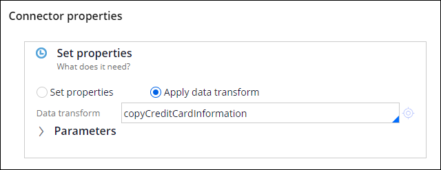
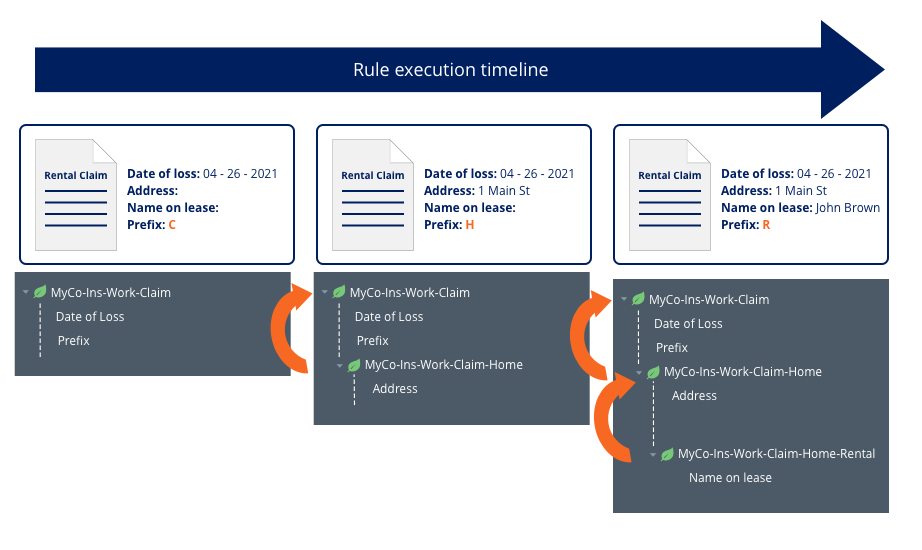
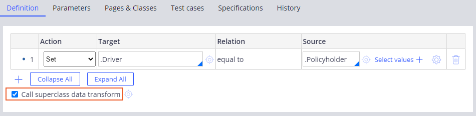

Application data manipulation

- [1. Data transforms](#1-data-transforms)
    - [1.1. Converting data using data transforms​](#11-converting-data-using-data-transforms)
    - [1.2. Calling data transforms in flows](#12-calling-data-transforms-in-flows)
- [2. Default property values](#2-default-property-values)
    - [2.1. Data initialization page](#21-data-initialization-page)
    - [2.2. Data transforms for default property values](#22-data-transforms-for-default-property-values)
- [3. Superclass feature](#3-superclass-feature)
    - [3.1. Data transform superclass feature](#31-data-transform-superclass-feature)
    - [3.2. Data transform superclass feature use case](#32-data-transform-superclass-feature-use-case)
    - [3.3. Configure the superclass feature for data transforms](#33-configure-the-superclass-feature-for-data-transforms)

## 1. Data transforms

The purpose of a data transform is to manipulate data in an application.

- Data transforms copy or manipulate data into the fields that you require.
- You can use data transforms to convert data from one type to another, iterate over page lists or page groups, and copy entire pages at a time. 

### 1.1. Converting data using data transforms​

You can use data transforms to convert data from one type to another type.

> To convert a string into a number, open the expression builder, click the **Configure** icon, and then use the out-of-the-box functions that are available in Pega Platform (`toInt()`).

### 1.2. Calling data transforms in flows

You can call a data transform from a flow.

- In a flow, click the connector to open the **Connector properties** window. In the **Set properties** section, select **Apply data transform**.

## 2. Default property values

When a user creates a case, you might want to set default values for properties that are already known to reduce the time that users spend entering data.

- Setting default values can also be useful in a development environment.
    - When you iteratively run a process to test your changes, you can save time by using a data transform to enter default values in required fields.

### 2.1. Data initialization page

You can edit `.pyDefault` values in App Studio by using the **Data initialization** page on a case type's **Settings** tab.

### 2.2. Data transforms for default property values

PEGA provides two types of data transforms that you can use to automatically set default property values and page properties when you create a case: `pyDefault` and `pySetFieldDefaults`. 

> As a best practice, use `pySetFieldDefaults` to set values for **UI fields**, and use `pyDefault` for **properties not referenced in the UI**.

The first time that you create a view for your case type, Pega Platform creates the `pyDefault` and `pySetFieldDefaults` data transforms. 

- When you create a new case, the `pyDefault` data transform is invoked by the `pyStartCase` process.
- `pyDefault` then invokes the `pySetFieldDefaults` data transform. 

## 3. Superclass feature

### 3.1. Data transform superclass feature

Developers can make data transforms more modular by using a superclass. 

- You can combine several data transforms using the superclass feature to set values at multiple levels of the class hierarchy.
- Taking advantage of this feature improves the maintainability of data transforms.

When the superclass feature is enabled on data transforms, at runtime, PEGA:

1. Identifies the parent of the current class
2. Identifies the next level parent until the highest parent class is located
3. Finds the data transform
4. Invokes data transforms

### 3.2. Data transform superclass feature use case

> Consider a Claim class with a Home subclass.
>
> 

### 3.3. Configure the superclass feature for data transforms

To configure the superclass feature, in the **Dev Studio** workspace, create a data transform with the same name at each class level and ensure the **Call superclass data transform** option is selected on the desired data transform. 

- If properties are specified in both the parent and subclasses, the data transform in the subclass overwrites the data transform in the parent class.

Pega Platform comes with standard pyDefault data transforms in the work classes from which the case types inherit.

- The standard `Work-` `pyDefault` data transform sets property values that are used in all case types.
    - The properties include work status, work urgency, and operator organization information.
    - You can override these default settings in the case type pyDefault data transform.

     

    > For example, the Work- pyDefault work urgency value is set to 10. If you want to prioritize cases in your case type, you can change the default urgency value for all new cases to 40.
