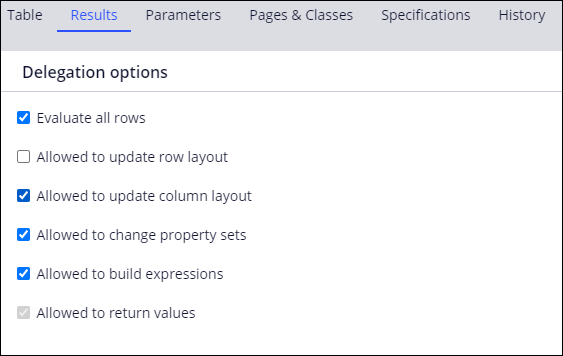
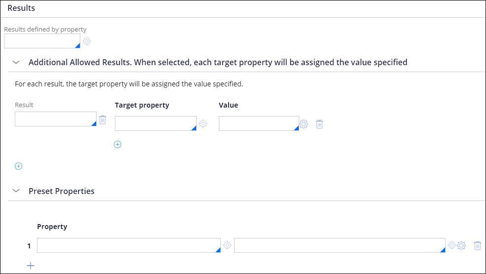
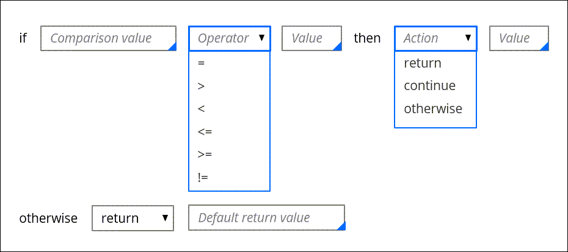
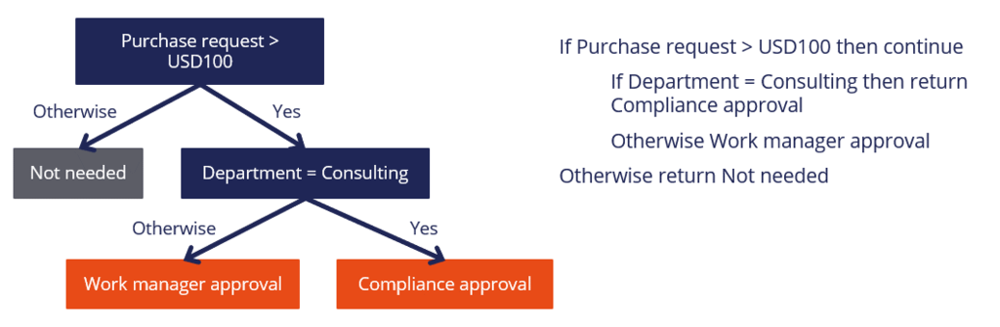

# Decision tables and trees

- [Decision tables and trees](#decision-tables-and-trees)
    - [1. Decision tables in Dev Studio](#1-decision-tables-in-dev-studio)
        - [1.1. Decision logic maintenance](#11-decision-logic-maintenance)
        - [1.2. Options for returning a result](#12-options-for-returning-a-result)
            - [1.2.1. Evaluation of all rows](#121-evaluation-of-all-rows)
            - [1.2.2. Result values](#122-result-values)
        - [1.3. Direct flow processing](#13-direct-flow-processing)
            - [1.3.1. Automated next steps](#131-automated-next-steps)
            - [1.3.2. Assignment routing](#132-assignment-routing)
    - [2. Decision trees](#2-decision-trees)
        - [2.1. Decision tree logic](#21-decision-tree-logic)
        - [2.2. Condition branches](#22-condition-branches)
            - [2.2.1. Nested branches](#221-nested-branches)
    - [3. Decision tree or decision table](#3-decision-tree-or-decision-table)
        - [3.1. Differences between decision tables and trees](#31-differences-between-decision-tables-and-trees)
            - [3.1.1. Decision tables](#311-decision-tables)
            - [3.1.2. Decision trees](#312-decision-trees)
        - [3.2. Considerations for use and configuration](#32-considerations-for-use-and-configuration)
    - [4. Decision rule conflicts](#4-decision-rule-conflicts)
        - [4.1. Conflict tests](#41-conflict-tests)
        - [4.2. Completeness tests](#42-completeness-tests)

## 1. Decision tables in Dev Studio

A decision table uses a set of conditions to test property values and return an appropriate response.

### 1.1. Decision logic maintenance

Organizations can delegate the maintenance of certain rules to stakeholders who manage a specific process within a case life cycle.

- In **Dev Studio**, you can delegate a decision table to a process owner, who can update the decision logic to meet the changing needs.
- When you delegate a decision table, use the **Delegation options** section of the **Results** tab to control the configuration options that are available to the process owner. 

### 1.2. Options for returning a result

Decision tables that are used to calculate a property value return a single result based on the decision logic. In **Dev Studio**, you can configure a decision table to return all successful results or set the value of additional properties.

#### 1.2.1. Evaluation of all rows

To return all successful results from a decision table, you select the **Evaluate all rows** check box in the **Results** tab of the decision table rule form. 

> When you set the **Evaluate all rows** option to true, the **Allowed to return values** setting is disabled.

#### 1.2.2. Result values

Use the options in this section to define the possible values that the decision table can return.

- If you need to add any entries to the allowed results, you can configure them by expanding the Additional Allowed Results section.
- You can also specify a list of preset properties to calculate before running the decision table.

### 1.3. Direct flow processing

You automate decision-making during a process to adjust the sequence of steps by using a decision table. 

#### 1.3.1. Automated next steps

You can determine the outcome of a process flow by using a decision shape to return an outcome based on several testable conditions.

> In **Dev Studio**, you add a decision shape to a flow by clicking **Flow shapes**, and then selecting Decision. When you specify the decision table for a decision shape, PEGA automatically adds a connector for each decision result.

#### 1.3.2. Assignment routing

You determine the appropriate operator or work queue for an assignment by selecting a decision table router. 

> When you route an assignment to a work queue, the `Assign-Workbasket` class rule is updated in **Dev Studio**.

## 2. Decision trees

### 2.1. Decision tree logic

You can use decision trees to handle logic that returns a result from a set of test conditions.

- Decision trees can evaluate against different test conditions and properties.
- A true comparison can lead to additional comparisons.

> Like a decision table, a decision tree consists of a set of conditions to evaluate, and results to return. Unlike a decision table, however, a decision tree consists of a series of branches that contain more- and more-specific conditions, ultimately leading to a return value.

### 2.2. Condition branches

Decision trees contain condition branches — a comparison value, a comparison operator, and an action.

- The action can be to return a result, to continue the evaluation, or stop the evaluation.
- The branches are organized in a hierarchical tree structure.
- When the decision tree is invoked, the system evaluates the top row and continues until it reaches a result that evaluates to true.
- If the system processes through all the branches but does not reach a returned result, the system returns the final otherwise value.

#### 2.2.1. Nested branches

You can organize decision tree branches in a nested structure.

## 3. Decision tree or decision table

### 3.1. Differences between decision tables and trees

Both decision tables and decision trees evaluate properties or conditions to return results when a comparison evaluates to true.

- **decision tables** evaluate against the same set of properties or conditions
- **decision trees** evaluate against different properties or conditions.

#### 3.1.1. Decision tables

- the values in a column evaluate against the same property/operator pair to return a value or property
- Developers can use a decision table when they have to evaluate many combinations of the same set of properties or conditions to return one value or property

#### 3.1.2. Decision trees

- Each branch in a decision tree evaluates the property/operator pair against a single value to perform an action, such as return a value or evaluate a nested condition.
- Developers can use a decision tree to evaluate conditions on different properties that might depend on other conditions.
- Each branch in a decision tree is evaluated, and all branches that evaluate to true perform the action that is described afterward, such as continuing the evaluation to the nested condition.

### 3.2. Considerations for use and configuration

Decision trees and decision tables perform similar functions. However, you cannot always use decision tables and decision trees interchangeably within PEGA applications.

- you can reference a decision table or decision tree on flow rules, declare expressions, activities, or routers.
    - Some configurations, such as cascading approvals with an authority matrix, support only evaluation of decision tables.
- The line-by-line structure of the decision tree provides an simple interface for a business stakeholder or low-code developer to configure and update dependent conditions that evaluate against different properties.
    - If you use a decision table in a situation where a few conditions evaluate against the same property, the decision table has empty boxes where a value is not needed for the decision.

## 4. Decision rule conflicts

The decision table and decision tree rule forms include the ability to test for conflicts and completeness.

### 4.1. Conflict tests

Checking for conflicts identifies if your decision rule prevents one or more of its rows or branches from ever being used.

- **Show conflicts** verifies incorrect conditions.
- A warning is displayed on the row, which causes the conflict to specify the condition that did not evaluate. 
    
> **Note**: When Evaluate all rows is selected for a decision table, the test does not show any conflicts because all conditions are evaluated.

### 4.2. Completeness tests

**Show completeness** identifies a decision table that has missing conditions or a decision tree that has missing branches.

- The system adds rows to indicate tests that are missing in the original decision rule.
- You can add returned results as additional rows if the decision rule needs a more detailed evaluation of the values.

> **Note**: Show completeness can generate a large number of rows when there are numerous combinations of values to test.
